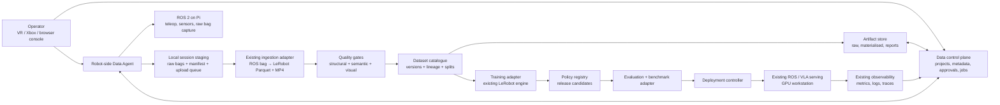
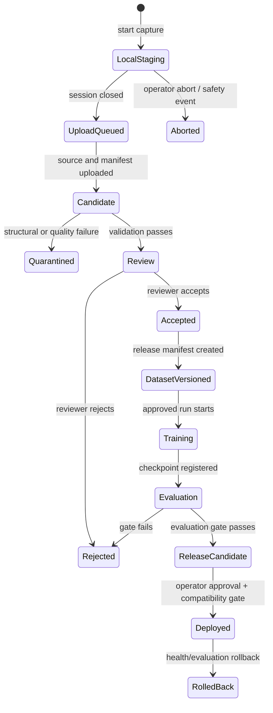

# 02 — Architecture and Feature Plan

**Status:** Proposed v1 technical architecture  
**Author:** Manus AI  
**Prepared:** 15 August 2026

## 1. Architectural decision

Build the product as a **local-first data plane with a server-side control plane**. Capture, synchronisation, temporary buffering, and policy execution stay close to the robot and GPU workstation. The product control plane stores metadata, permissions, job state, version manifests, approvals, and audit records. Large artifacts move through resumable background transfers to object storage; they do not flow through the browser or block teleoperation.

This decision follows the real physical topology already present in the repository: ROS 2 runs on the Pi, GPU inference/training runs on a workstation, and the VLA policy consumes camera/state topics before producing motion and arm commands.[1] It also prevents a common robotics-product failure: treating high-bandwidth, safety-sensitive edge operations as ordinary web requests.

## 2. Viable implementation approaches

Two approaches can satisfy the product goal. The first is recommended because it uses the current robotics architecture and maintains a credible low-latency/safety boundary.

| Approach | What the user experiences | Trade-offs | Cost | Setup complexity |
|---|---|---|---|---|
| **A. Local-first agent with a metadata control plane — recommended** | Capture and preflight work even when the internet is unavailable. The user sees local progress immediately; data and artifacts sync in the background. | Requires a small, versioned edge service and a resumable-sync protocol. It is more engineering initially, but correctly accommodates video, ROS, hardware drivers, and safety. | Low incremental infrastructure cost in development; storage and managed metadata costs rise with adoption. | Medium. Reuses current Python/ROS/GPU components but introduces an explicit service boundary. |
| **B. Cloud-first capture client** | The browser or a thin client streams sessions directly to a hosted service. | Faster to prototype a dashboard, but fragile under intermittent networks, expensive for raw video, and inappropriate for robot control or on-device diagnostics. It would duplicate ROS integration in the cloud and weaken data sovereignty. | Higher egress/ingest cost and more always-on hosting. | Lower initially, then high as offline/retry/control constraints accumulate. |

**Decision:** implement Approach A. The first edge service may be a Python process launched alongside the current robot stack. It should be deliberately small: it orchestrates already-existing record/convert/validate components rather than embedding a second robotics framework.

## 3. System context



### 3.1 Responsibilities by component

| Component | Responsibility | Must not do | Initial implementation leverage |
|---|---|---|---|
| **Data Agent** | Preflight probes, capture-session lifecycle, local manifest creation, local staging, conversion job submission, resumable artifact sync, and device-side audit events. | Directly publish motion commands, decide that a policy is safe, or become the canonical training implementation. | ROS 2 launch/recording paths, `teleop_recorder_node`, existing bag converter, and deployment configuration.[1] [2] |
| **Capture adapter** | Start/stop the correct recorder, collect declared topics, write source metadata, and record discontinuities/safety events. | Infer task success or silently fill missing streams. | Current ROS topic map, camera contract, and teleoperation components.[1] |
| **Ingestion adapter** | Run the existing bag-to-LeRobot materialisation in a job staging directory and publish every output artifact. | Modify a released dataset in place. | `bag_to_omnibot.py` and the structural validator.[2] [3] |
| **Quality service** | Evaluate structural validity, temporal coverage, missingness, range limits, duplicates, video decodability, task labels, and review decision. | Train or deploy automatically. | Existing validator plus new quality checks.[3] |
| **Control-plane API** | Persist projects, robots, sessions, episodes, dataset versions, training runs, policies, deployments, audit events, and access policy. | Carry raw camera streams or store opaque state only in a browser. | The existing website can become a client once a real backend is introduced. |
| **Artifact store** | Persist large immutable artifacts with content hash, retention policy, signed access, and lifecycle state. | Be used as a mutable source directory for live capture. | S3-compatible storage in production; local filesystem/MinIO in development. |
| **Training adapter** | Resolve a frozen dataset version into a materialised local path, invoke approved model configurations, stream metrics, and register checkpoints. | Select an unsafe release or hide environment dependencies. | Existing `lerobot_engine/train.py` and W&B integration after its loop is corrected.[4] |
| **Policy registry / deployment controller** | Bind model artifacts to dataset/training/evaluation lineage; enforce robot/profile compatibility, human approval, enable/rollback, and audit events. | Run the policy itself. | Existing serving endpoints, ROS nodes, multiplexers, and metrics.[1] [5] |
| **Web and agent interfaces** | Present real persisted state and invoke auditable backend commands. | Fabricate statuses, exports, or Hub-push confirmations. | Replace the current sample episode catalog and in-memory tool handlers.[6] [7] |

## 4. Data model and immutable lifecycle

### 4.1 Entity model

| Entity | Immutable identity | Purpose | Minimum fields |
|---|---|---|---|
| **Robot profile** | `robot_profile_id@version` | Declares supported hardware, ROS topic map, action/state schema, sensors, calibration requirements, and safety limits. | profile name/version, schema hash, supported topics, camera IDs, safety envelope, compatibility status. |
| **Robot instance** | `robot_id` | A physical or simulated instance using a profile. | profile version, serial/device identifiers, software/firmware version, calibration IDs, operator owner. |
| **Capture session** | `session_id` | Top-level recording event, held locally first and later registered remotely. | robot ID, task, operator, data source, start/end time, code commit, config hashes, safety events, local/remote sync state. |
| **Episode candidate** | `episode_id` | A materialised capture unit submitted to quality gates. | source session, artifact hashes, temporal coverage, quality report, reviewer status, reject reason. |
| **Dataset version** | `dataset_id@semver` plus content hash | Immutable collection of accepted episodes and its exact training contract. | ordered episode membership, split manifest, schema/profile version, statistics, quality policy version, provenance manifest, release notes. |
| **Training run** | `run_id` | Reproducible model-generation event. | dataset version, code commit, container/environment, model config, seed, hardware profile, metrics, checkpoint artifacts. |
| **Policy release** | `policy_id@version` | A deployment candidate with evidence and compatibility. | originating run/checkpoint, supported profile, safety/evaluation record, approver, artifact hash, release state. |
| **Deployment** | `deployment_id` | Assignment of one policy release to a robot. | policy release, robot instance, start/end, current health, rollback target, operator approval. |
| **Evidence record** | `evidence_id` | Links a benchmark, evaluation, incident, or report to a release. | execution context, inputs, outputs, result/artifact hashes, timestamp, signer/actor. |

### 4.2 Lifecycle rules



The following invariants are mandatory:

1. **No dataset version is mutable.** Adding an episode produces a new version; it does not append to a training source directory.
2. **Every materialisation is traceable to raw source artifacts** through hash, source session, parser/ingestor version, schema version, and configuration.
3. **Simulation and physical data are separate declared sources.** A dataset version must state the count and fraction of each; training may combine them only through an explicit policy.
4. **No policy can be deployed merely because training completed.** It must have a compatible profile, an evaluation record, named approver, and a rollback target.
5. **Every destructive action is soft-delete first.** Deleting an episode changes review eligibility and creates an audit event; a retention job eventually removes artifacts per policy.

### 4.3 Required manifest contract

The current LeRobot files remain the data payload. Add `manifest.json` next to each immutable dataset release, for example:

```json
{
  "schema_version": "ohho.dataset-manifest/v1",
  "dataset": {"id": "omnibot-pick-place", "version": "0.1.0", "content_sha256": "..."},
  "robot_profile": {"id": "omnibot-mobile-manipulator", "version": "1.0.0", "schema_sha256": "..."},
  "sources": {"physical_episodes": 42, "simulation_episodes": 18},
  "episodes": [{"episode_id": "...", "source_session_id": "...", "artifact_sha256": "..."}],
  "splits": {"strategy": "group_by_session", "train": ["..."], "validation": ["..."], "test": ["..."]},
  "materialisation": {"format": "lerobot-v2", "ingestor_commit": "...", "config_sha256": "..."},
  "quality": {"policy_version": "1.0.0", "report_uri": "...", "accepted_at": "..."},
  "statistics": {"artifact_uri": "...", "sample_count": 0},
  "created_by": "user_or_service_id",
  "created_at": "RFC-3339 timestamp"
}
```

The split must be **session-aware**, not an arbitrary row-level random split. Adjacent frames from the same physical attempt otherwise leak strongly correlated scenes and operator actions into both training and evaluation. Evaluation data should additionally include holdout object poses, lighting, operator, or environmental conditions where the task design permits.

## 5. Product features by release

### 5.1 Release 0 — Honest golden-path shell

Release 0 does not add broad capability. It creates a trustworthy product surface around the current scripts.

| Feature | User-visible behaviour | Backend/edge behaviour | Acceptance criterion |
|---|---|---|---|
| **Supported profile selection** | The console shows OmniBot as the only production-ready profile and lists required camera/topic contract. | Stores a versioned robot profile and validates a robot instance against it. | Unsupported profiles cannot enter a capture session. |
| **Connection preflight** | The user sees camera, topic, disk, time-sync, and safety/estop readiness. | Data Agent probes ROS graph and local storage, records a signed preflight result. | Capture cannot start when a required stream is absent or stale. |
| **Capture session** | User names the task and starts/stops/aborts a session. | Records raw source, session manifest, operator events, and upload queue. | A session can be closed offline and recovered after restart. |
| **Real catalogue read path** | The console lists candidate episodes and their real artifacts/status. | Control-plane records reference object-store/local artifacts. | No representative hard-coded episode is shown in production mode. |
| **Basic quality report** | User sees structural status, duration, frame count, stream coverage, and missingness. | Runs existing validator plus video decode and stream metrics. | Bad artifacts are quarantined with a machine-readable reason. |

### 5.2 Release 1 — Dataset curation and reproducibility

| Feature | User-visible behaviour | Engineering detail |
|---|---|---|
| **Episode review** | An operator can inspect synchronized video/state/action plots, task text, quality flags, and mark keep/reject/review. | Persist review decisions with user, reason, timestamp, and original result; never mutate raw source. |
| **Quality policy** | A project declares thresholds for duration, synchronisation coverage, blank frames, action limit violations, and failed safety conditions. | Policy version is included in every quality report and dataset manifest. |
| **Dataset composer** | User filters accepted episodes, sees source composition, and creates a named immutable version. | Generates materialised layout or an index manifest; calculates count-aware statistics. |
| **Session-aware splits** | User can accept an automatically proposed split or pin a holdout set. | Splits group by session/source and record deterministic seed/logic in manifest. |
| **Artifact browser** | User can download/open raw, materialised, quality, and manifest artifacts with permissions. | Content-hash each artifact, issue time-limited signed URLs, and maintain retention state. |

### 5.3 Release 2 — Train, evaluate, and deploy

| Feature | User-visible behaviour | Engineering detail |
|---|---|---|
| **Training-run launcher** | User selects a dataset version, supported policy/model configuration, and target GPU profile. | Submit a job to a local/GPU runner that invokes the hardened current trainer with resolved immutable inputs. |
| **Run comparison** | User views loss, dataset version, environment, cost/time, checkpoints, and evaluation result side by side. | Capture stdout/metrics and register W&B URL/artifacts where enabled; do not rely on W&B as the sole record. |
| **Evaluation harness** | User runs fixed simulation/physical scenarios and records success/failure labels. | Tie scenario definition, robot profile, commit, model hash, and results to an evidence record. |
| **Policy registry** | User sees candidate/approved/retired releases and exact compatibility. | Verify model artifact hash, state/action schema, camera contract, image preprocessing, and safety limits. |
| **Deployment and rollback** | User explicitly deploys one approved release and can return to the last known-good one. | Enable an existing policy runtime only after compatibility/approval gate; emit audit and health events. |

### 5.4 Deferred after v1 evidence

Marketplace publishing, cross-robot adapter authorship, automatic data labelling, cloud training orchestration, fleet-scale scheduling, and industrial connectors become viable only after real external users complete the narrow loop and the platform captures reliable lineage/usage evidence.

## 6. Interfaces to retain and replace

| Current surface | Decision | Required change |
|---|---|---|
| ROS 2 bags as raw capture source | **Retain** | Give every bag a capture-session manifest and content hash. |
| `bag_to_omnibot` LeRobot converter | **Retain but harden** | Run in isolated staging; fail on unacceptable quality rather than substituting black frames; emit immutable outputs and job result. |
| LeRobot Parquet + MP4 layout | **Retain** | Treat it as materialised data payload, with OhhO manifest/provenance outside the format. |
| Existing structural validator | **Retain and extend** | Add semantic/schema/range/video/synchronisation checks and a JSON quality report. |
| `lerobot_engine/train.py` | **Retain after repair** | Fix training-loop indentation, make environment/config explicit, consume manifest-selected data, and report artifacts. |
| ROS/`vla_serve` policy runtime | **Retain** | Add registry/deployment adapter; retain local inference and existing health endpoints. |
| Website Data console | **Replace its data source** | Keep successful interaction patterns, but make the source real persisted API records; label demo mode separately. |
| Data MCP tools | **Replace their handlers** | Map every read/mutation to an authorised API operation and audit event; never fabricate mutation success. |

## 7. Quality, safety, and security gates

### 7.1 Data quality gate

A candidate episode passes only if it meets all hard rules in its declared quality policy:

| Check | Suggested v1 hard rule | Why it matters |
|---|---|---|
| Required streams | 100% of required state/action streams; each required camera meets a declared coverage threshold. | Prevents silent missing modality training. |
| Synchronisation | p95 nearest-stream delta below profile tolerance; zero out-of-order timestamps. | Preserves state/action/image correspondence. |
| Video integrity | Every referenced video decodes; no blank-frame percentage above threshold. | File existence is insufficient evidence of usable observations. |
| State/action bounds | Values stay within profile limits or are explicitly labelled as a safety/recording exception. | Prevents unit mismatches and unsafe actuator targets. |
| Episode completeness | Duration and frame count fall within task policy range; session closed normally unless explicitly accepted as failure data. | Filters accidental snippets and interrupted capture. |
| Leakage | Train/validation/test membership is group-separated by capture session. | Gives evaluation credibility. |

### 7.2 Deployment gate

The deployment controller must reject a release if any one of the following is absent or incompatible: an approved dataset version, completed run manifest, policy artifact hash, state/action shape match, camera/preprocessing declaration, robot-profile compatibility, evaluation evidence, operator approval, a known rollback release, and a recent deployment preflight. The policy remains subject to the existing control multiplexers and emergency-stop path; product metadata must never bypass physical safety controls.[1]

### 7.3 Access and data handling

Protect raw teleoperation video, environment imagery, robot topology, model checkpoints, and customer task descriptions as sensitive artifacts. In v1, require project-scoped role-based access, short-lived artifact URLs, action audit logs, encrypted storage/transport, no credentials in session manifests, and explicit project-level retention settings. Public dataset publication must be a separate, affirmative release state with a dataset card and redaction review.

## 8. Non-functional requirements

| Concern | v1 target |
|---|---|
| **Offline resilience** | Start/stop capture and preserve sessions without a control-plane connection; sync resumes after restart/network loss. |
| **Integrity** | Hash all uploaded artifacts; use idempotency keys and transactional metadata commit for jobs. |
| **Performance** | No product-service dependency in the control path for teleoperation; local capture observability updates within a few seconds. |
| **Reproducibility** | Every dataset version, training run, benchmark, evaluation, and deployment records code/config/environment/artifact identifiers. |
| **Observability** | Every asynchronous operation has state, logs, error reason, duration, and correlation ID. |
| **Portability** | The source data contract is profile-driven and LeRobot-compatible; robot-agnostic support comes by adding tested profiles, not weakening contracts. |

## References

[1]: ../../AGENTS.md "Distributed ROS, GPU, teleoperation, policy, safety, and observability architecture"
[2]: ../../data_engine/ingestion/bag_to_omnibot.py "LeRobot conversion and current mutable metadata behaviour"
[3]: ../../data_engine/scripts/validate_dataset.py "Current structural validation"
[4]: ../../lerobot_engine/train.py "Training adapters, dependencies, and current loop"
[5]: ../../packages/vla_serve/vla_serve/inference/server.py "Serving API, health, authentication, rate limiting, and metrics"
[6]: ../../website/lib/data/episodes.ts "Current browser-only representative episode surface"
[7]: ../../website/lib/data/mcp-tools.ts "Current representative Data tool handlers"
