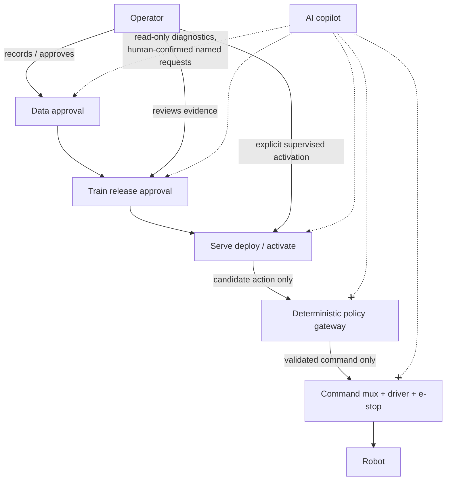

# OmniBot Data → Train → Serve: Integrated Operating Plan

**Status:** Proposed v1 operating model and implementation plan  
**Author:** Manus AI  
**Prepared:** 15 August 2026  
**Scope:** Connect the existing Data Platform, Train + Pilot/VR platform, and Serve platform into one auditable robot-learning lifecycle for the supported OmniBot reference configuration.

## Executive decision

**Data, Train, and Serve are not three independent products. They are three stages of one controlled learning system.** Data establishes what happened and whether it is suitable for learning. Train converts an approved, immutable dataset into evaluated policy candidates. Serve turns one approved candidate into bounded, observable robot behaviour and sends the resulting outcomes back to Data.

The v1 user promise is deliberately narrow:

> **A trained operator can collect a Quest 3/ROS demonstration on the supported OmniBot, approve it into a versioned dataset, train and evaluate a named policy, deploy that exact policy under supervision, and use the resulting runtime evidence to improve the next dataset.**

The system must be built as a **single vertical product workflow**. Building a rich Data console, a separate Train dashboard, and a generic Serve API in parallel will reproduce the repository’s current issue: impressive surfaces with incomplete handoffs. The first release must make one reference task work end-to-end before expanding robot support, model catalogue, cloud hosting, or fleet controls.[1] [2] [3]

## 1. How the three platforms work together

```mermaid
flowchart LR
    OP[Operator in Pilot / VR]
    RB[Reference OmniBot\nROS 2 + sensors + drivers]

    subgraph DP[Data Platform — truth and curation]
      CS[Capture session]
      EP[Candidate episode]
      DQ[Validation + quality decision]
      DV[Immutable dataset version]
      CS --> EP --> DQ --> DV
    end

    subgraph TP[Train Platform — learning and evidence]
      TR[Training run]
      MA[Model artifact]
      EV[Evaluation report]
      PR[Approved policy release]
      TR --> MA --> EV --> PR
    end

    subgraph SP[Serve Platform — controlled runtime]
      DE[Deployment record]
      RT[Verified policy runtime]
      GW[Deterministic policy gateway]
      AO[Runtime outcome + audit]
      DE --> RT --> GW --> AO
    end

    OP -->|supervised teleop\n+ labels| CS
    RB -->|bags, camera, state, safety\n+ calibration metadata| CS
    DV -->|dataset manifest + profile contract| TR
    PR -->|release manifest + artifact digest| DE
    GW -->|bounded base/arm candidate only| RB
    RB -->|metrics, intervention, task result\n+ failure evidence| AO
    AO -->|new raw episodes + quality signals| DP
```



| Platform | Owns | Accepts only | Produces | Must never claim |
|---|---|---|---|---|
| **Data** | Capture provenance, raw episode assets, quality decisions, dataset membership, data versions and splits. | Robot/Pilot capture sessions that match a registered robot profile and schema. | Immutable `dataset_version` manifest plus quality report and artifacts. | That a raw bag, JSONL file, or UI card is trainable data without validation and approval. |
| **Train** | Training jobs, reproducible environments, checkpoints, evaluation evidence, promotion decision and policy-release manifests. | An approved immutable dataset version with compatible profile/action contract. | Evaluated model artifact and `policy_release` candidate/approval record. | That a checkpoint is deployable because training finished or loss declined. |
| **Serve** | Runtime target inventory, deployment state, readiness, policy gateway decisions, live telemetry, incidents, rollback and outcome events. | An approved policy release plus a compatible healthy robot/runtime target. | Bounded supervised policy execution and runtime outcome evidence. | That a model endpoint, demo UI, or raw numeric vector is safe robot control. |

## 2. The single shared backbone

The integration succeeds only if all three platforms use a few shared identifiers and immutable contracts. Do not create a separate database schema per console and attempt to reconcile them later.

### 2.1 Shared source-of-truth objects

| Object | Created by | Immutable identity | Required consumers | Why it exists |
|---|---|---|---|---|
| **Robot profile** | Platform/robotics owner | `robot_profile_id`, semantic version, contract digest. | Data, Train, Serve, Pilot. | Declares sensor topics, calibration, preprocessing, joint order, action/state schemas, limits, control modes, and compatible runtime. |
| **Task specification** | Product/robotics owner | `task_spec_id`, version, scenario bundle digest. | Pilot, Data, Train, evaluation, Serve. | Defines instruction vocabulary, initial conditions, success/failure rules, safety envelope, and allowed supervision mode. |
| **Capture session** | Robot-side Data Agent / Pilot | `capture_session_id`, robot/profile/task/session build identities. | Data reviewer, Train provenance, Serve audit. | Binds a human-operated teaching attempt to raw assets and safety/telemetry evidence. |
| **Episode** | Data ingestion | `episode_id`, source hashes, synchronisation/quality results. | Dataset version builder, reviewers. | A validated candidate learning unit derived from a session. |
| **Dataset version** | Data approval workflow | `dataset_version_id`, membership manifest hash, split hash. | Train only. | Freezes exactly which episodes, transforms, schema, code, calibration/configuration and quality decision were used. |
| **Training run** | Train orchestrator | `train_run_id`, code/env/config/dataset/hardware digests. | Evaluation, release review. | Makes policy generation reproducible and attributable. |
| **Model artifact** | Train output | artifact checksum plus adapter/model-format identity. | Evaluation and Serve packaging. | Identifies checkpoint/export and all required model assets. |
| **Evaluation report** | Train/evaluation runner | `evaluation_id`, scenario/results hashes. | Release approver, Serve preflight. | Separates training completion from evidence of task suitability. |
| **Policy release** | Train release workflow | `policy_release_id`, release manifest digest. | Serve only. | Binds model artifact to approved data/run/evaluation, action semantics, robot compatibility, runtime requirements and rollback predecessor. |
| **Deployment** | Serve orchestrator | `deployment_id`, target/release/image/runtime digests. | Console, agent, Data feedback. | States where a release was staged/active and whether readiness/gateway checks passed. |
| **Runtime outcome event** | Gateway/robot-side agent | `outcome_event_id`, correlation and release/session identifiers. | Data quality, Train analysis, Serve operations. | Records task result, intervention, safety event, command/gateway decision, latency and trace references. |

The first database migration should model these as a connected lifecycle. A dataset version cannot be deleted while referenced by a run; a release cannot be edited after approval; a deployment cannot point to an unknown release; and runtime events are append-only evidence rather than mutable UI history.

### 2.2 Shared identifiers in every record

Every payload, artifact metadata entry, log, metric, and audit event should include the applicable identifiers below. Absence is a rejectable integration failure, not a best-effort enrichment task.

| Field | Purpose |
|---|---|
| `project_id` | Separates users/experiments and is ready for future multi-project operation without making v1 multi-tenant. |
| `robot_id` and `robot_profile_id` + version/digest | Prevents data/policy created for one physical configuration being used by another. |
| `task_spec_id` + version | Keeps capture, evaluation and deployment intent comparable. |
| `capture_session_id`, `episode_id`, `dataset_version_id` | Establishes Data provenance. |
| `train_run_id`, `model_artifact_digest`, `evaluation_id`, `policy_release_id` | Establishes Train/release provenance. |
| `deployment_id`, `runtime_id`, `correlation_id` | Traces a live policy decision and its outcome. |
| `schema_version` / `contract_digest` | Rejects silent semantic drift in images, state, actions, calibration, normalisation, or control limits. |
| `actor_id`, `approval_id`, timestamps | Makes capture, data approval, release approval, activation, intervention and rollback auditable. |

## 3. The four contracts that connect the products

The implementation should begin with schemas and contract tests, not UI routes. These four handoffs contain the entire product.

### 3.1 Pilot/robot → Data: `CaptureSessionManifest`

The Pilot/VR application and robot-side Data Agent jointly create this record when an operator starts a teaching session. It is the authoritative handoff from live teleoperation to Data.

| Contract section | Minimum contents | Gate before Data accepts it |
|---|---|---|
| **Identity** | Project, session, operator, robot, robot profile, task specification, VR app/robot-agent build versions. | Profile and task are registered/supported. |
| **Source assets** | ROS bag/source hashes, JSONL/VR recording hashes, camera/state topic mapping, local paths or artifact IDs. | Every declared artifact exists, is readable, and has a checksum. |
| **Time/synchronisation** | Start/end time, clock source, topic timestamps, synchronisation result, dropped-frame/gap summary. | Time/stream quality is within task/profile threshold. |
| **Physical context** | Calibration/configuration references, camera selection, control mode, workspace, network quality. | Required calibration/configuration matches profile. |
| **Safety and operator evidence** | E-stop/deadman/mode-switch events, interventions, faults, operator notes, consent/permissions if required. | No unresolved safety incident; incident-marked episodes require review. |

**Data behaviour:** Store this manifest and raw assets locally first. Convert to candidate episode(s), run deterministic validation, show a quality report, then allow human approve/reject/quarantine. A direct JSONL upload must not create a trainable dataset by itself.[1] [2]

### 3.2 Data → Train: `DatasetVersionManifest`

Train accepts only a frozen dataset version, not a folder path, `latest` pointer, browser-selected episodes, or raw capture-session ID.

| Contract section | Minimum contents | Train preflight rejection examples |
|---|---|---|
| **Identity and membership** | Dataset ID/version, immutable episode list/hash, split manifest/hash, creator/approval. | Duplicate/missing episode, mutable membership, unknown approval state. |
| **Schema/profile** | Robot profile and sensor/state/action schema digests; joint order, frame, units and action representation. | Different 9-D convention, missing camera, unknown units/frame, profile mismatch. |
| **Materialisation** | LeRobot/Parquet/MP4/raw-bag artifact URIs/checksums, transformation and ingestion code commit. | Missing asset, checksum mismatch, unsupported format/version. |
| **Quality** | Per-episode validation outcomes, exclusions/quarantine reasons, distribution/stats report. | Required quality gate failed, empty class/task segment, unreviewed safety event. |
| **Reproducibility** | Capture/calibration/config references and deterministic split seed/rules. | Split not deterministic or config cannot be resolved. |

**Train behaviour:** Create the training run from this manifest, copy only immutable references, and record the resolved dataset manifest digest in all checkpoints, metrics, evaluations and release candidates. It must refuse datasets that are only locally “validated” but not versioned/approved.[1]

### 3.3 Train → Serve: `PolicyReleaseManifest`

Serve accepts only an approved policy release. A checkpoint file, Hugging Face path, model name, or UI-selected adapter is insufficient.

| Contract section | Minimum contents | Serve preflight rejection examples |
|---|---|---|
| **Lineage** | Dataset version, Train run, code/environment/container digests, artifact model/checkpoint digest. | No reproducible lineage or artifact digest. |
| **Compatibility** | Robot profile, camera/preprocessor contract, state/action schema, action width/order, units/frame, normalisation/unnormalisation asset digest. | Model output cannot be interpreted against target robot. |
| **Runtime requirements** | Adapter family/version, image digest, GPU/CUDA/driver/provider requirements, required ROS interfaces. | Runtime target does not meet hardware/software requirements. |
| **Evidence and policy** | Fixed evaluation results, benchmark/latency results, known limits, reviewer approval, permitted task/supervision mode. | No gate approval; unmeasured latency; task not allowed. |
| **Rollback** | Compatible known-good predecessor and rollback procedure/evidence. | No recovery path. |

**Serve behaviour:** Stage a separate immutable release runtime, load/check the exact artifacts, demonstrate readiness using a known fixture, and test candidate-action contract through the ROS policy gateway before acquiring any control lease. It never loads arbitrary `model_path` values in production.[3]

### 3.4 Serve → Data/Train: `RuntimeOutcomeEvent`

Serve closes the learning loop by creating high-value data about actual behaviour, not just a green endpoint status.

| Event dimension | Minimum contents | Consumer use |
|---|---|---|
| **Context** | Deployment/release/run/dataset/profile/task/robot/session/correlation identities. | Trace an outcome back to its training evidence. |
| **Runtime** | Readiness state, adapter/image/runtime identity, preprocessing/inference/gateway latency, GPU/health state. | Separate runtime degradation from model weakness. |
| **Control** | Mode owner/lease, candidate accepted/rejected/held, reason codes, command age, estop/driver state. | Diagnose safety/gateway/mux behaviour. |
| **Outcome** | Success/failure/timeout, operator intervention, failure taxonomy, optional review label. | Curate hard examples and compare releases. |
| **Artifacts** | Links to raw bags/video/VR traces/logs/metrics, privacy/retention marking. | Create candidate follow-up episodes or incident investigations. |

**Data behaviour:** Runtime outcomes do not silently modify an approved dataset. They create new candidate episodes or labelled incident evidence. A reviewer decides whether they are valid demonstrations, failure examples, holdout evaluation, or quarantine. **Train behaviour:** Reports slice performance and failure categories against release/dataset lineage before a new data version is proposed.[1] [2] [3]

## 4. End-to-end lifecycle: one golden-path run

| Step | Primary product | What happens | Gate / output |
|---:|---|---|---|
| 0 | Shared platform | Register one reference robot profile and one fixed task specification. | Contract digest is visible to Pilot, Data, Train and Serve. |
| 1 | Pilot + Data | Operator passes teleop/capture preflight and starts a labelled Quest 3/ROS session. | `CaptureSessionManifest` and local raw artifacts begin. |
| 2 | Data | Robot-side agent finalises assets; ingestion synchronises topics and builds candidate LeRobot episodes. | Deterministic validation and quality report. |
| 3 | Data | Reviewer approves/rejects/quarantines episodes, creates immutable split and dataset version. | `DatasetVersionManifest` with membership and statistics hashes. |
| 4 | Train | Train preflight verifies profile/schema/action compatibility and creates reproducible run. | `train_run_id`, resolved config/environment/dataset identities. |
| 5 | Train | Selected baseline model trains or fine-tunes; artifacts, metrics and checkpoints are persisted. | Model artifact plus run evidence. |
| 6 | Train | Fixed simulation/recorded/hardware-safe evaluation runs; reviewer approves or rejects promotion. | `PolicyReleaseManifest` only if evidence and rollback target exist. |
| 7 | Serve | Target compatibility and immutable runtime image/artifact checks run; runtime warms without motion authority. | Deployment is staged and `/readyz` with release identity passes. |
| 8 | Serve | Gateway receives fixture candidates, checks profile/action/age/limits; operator activates explicit base/arm policy lease. | Active deployment with only gateway-specific command sources. |
| 9 | Serve + Pilot | Supervised bounded task runs. Operator can observe, disable, teleoperate, estop, or roll back. | Append-only runtime outcome, telemetry and raw artifacts. |
| 10 | Data + Train | Runtime result is reviewed, added to failure taxonomy and optionally curated into next candidate dataset. | New evidence drives the next controlled iteration—not silent self-training. |

## 5. Safety and authority model

The three platforms do not share equal authority. Data and Train decide **what may be learned and promoted**. Serve decides **whether an already-approved policy may run on a particular target now**. None of these products bypass deterministic robot safety controls.



| Decision | Authority | Required evidence | Deny/default action |
|---|---|---|---|
| Start/end a capture | Operator plus deterministic Pilot/ROS safety preflight. | Correct profile, deadman/estop/control-mode health, local storage. | Do not record/control; explain failure. |
| Approve dataset version | Named data reviewer. | Quality report, immutable membership/splits, provenance and safety review. | Candidate remains quarantined/unapproved. |
| Start training | Train preflight service. | Approved compatible dataset version and resolved environment. | No job is created. |
| Promote release | Named release reviewer + policy rule. | Evaluation, benchmark, compatibility, known limits, rollback predecessor. | Release stays candidate/rejected. |
| Deploy/activate policy | Serve orchestrator plus explicit operator request. | Approved release, target readiness, gateway contract test, healthy robot and free control lease. | Stay staged/disabled; no motor command. |
| Allow individual action | Deterministic gateway and existing driver/mux/e-stop chain. | Exact active release/profile, fresh observation/action, schema/limit/mode checks. | Reject/hold/zero according to controller safety policy. |
| Add runtime data to learning | Data reviewer. | Outcome context, artifact integrity, safety/consent/quality review. | Retain as incident/diagnostic evidence only. |

## 6. Architecture to build first

### 6.1 Keep three planes distinct

| Plane | Primary components | Responsibilities | Not responsible for |
|---|---|---|---|
| **Robot/edge plane** | Quest 3 Unity app, ROS 2, Data Agent, local capture buffer, policy gateway, mux/driver/e-stop, GPU runtime. | Real-time teleop/control, local capture, bounded inference, safety decision, WAN-tolerant operation. | Acting as browser source of truth or cloud-dependent safety mechanism. |
| **Control plane** | Database/API, identity/roles, project/profile/task registry, lifecycle state machines, review/audit, job/deployment orchestration. | Stores immutable manifests and state transitions; controls authority. | Carrying high-rate camera/actuator traffic. |
| **Artifact/evidence plane** | Local durable buffer, object storage, model/dataset artifact registry, run/evaluation/benchmark/outcome evidence. | Content-addressed raw/video/dataset/checkpoint/report storage and retention. | Making safety/activation decisions in real time. |

### 6.2 Build one shared lifecycle API

A single backend can initially expose domains as modules rather than independent services:

```text
/projects
/robot-profiles
/task-specifications
/capture-sessions             ← Data ingress/review
/episodes
/dataset-versions             ← Data approval
/training-runs                ← Train jobs/evidence
/evaluations
/policy-releases              ← Train promotion
/runtime-targets
/deployments                  ← Serve stage/activate/rollback
/runtime-outcomes             ← Serve feedback
/audit-events
```

Each command should create an append-only audit event and return an asynchronous job/deployment/run receipt. The web console and agent must read these persisted records. They must not infer state from in-memory demos, browser timers, or fabricated localhost endpoints.[1] [2] [3]

### 6.3 Start with adapters, not rewrites

| Existing repository capability | Integrate as | Required change before it participates in v1 |
|---|---|---|
| ROS bag → OmniBot/LeRobot converter and dataset validator | Data ingestion/quality adapter. | Emit manifests, artifact hashes, deterministic quality result and versioned schema outcome. |
| Quest 3 recorder and robot upload bridge | Pilot/Data capture adapter. | Produce authenticated session manifest and verified artifact transfer; record profile/safety/calibration context. |
| `lerobot_engine` / learning engine | Train executor adapter. | Repair CLI integration, accept only `dataset_version_id`, persist real job/evaluation artifacts and run manifest. |
| Existing evaluation/benchmark scripts | Evaluation evidence adapter. | Store durable machine-readable result artifacts tied to run/release/profile. |
| `packages/vla_serve` and ROS policy nodes | Serve runtime adapter. | Use release-selected exact adapter; replace generic action parsing; emit typed candidate action and readiness evidence. |
| ROS command muxes and drivers | Final deterministic control path. | Feed only gateway-stamped policy sources and add explicit lease/freshness/transition rules. |
| Website Data/Train/Serve consoles and MCP tools | Workflow clients. | Replace representative client state/simulated writes with lifecycle API reads and real job/deployment receipts. |

## 7. Implementation sequence

### Phase A — Weeks 1–2: shared contract spine

Do this before “building Data first” or “repairing Serve first.” It prevents three incompatible interpretations of the same robot.

| Deliverable | Outcome |
|---|---|
| Reference robot profile and task-specification schemas | One `omnibot-quest3-so101@1.0.0` contract for camera, state/action, calibration, limits, control modes and task. |
| Lifecycle data model and immutable manifests | Data version, run, release, deployment, and outcome records can link end-to-end. |
| Identity/role/action policy | Explicit capture, review, train, promote, deploy, activate, rollback authorities and audit events. |
| Correlation/telemetry convention | All Robot/Pilot/Data/Train/Serve evidence has shared IDs. |
| Demo truthfulness rule | Production UIs use persisted lifecycle state only; demo data is isolated and labelled. |

**Exit gate:** A test fixture can traverse all manifest schemas from capture session to a dry-run deployment without lossy field conversion.

### Phase B — Weeks 3–4: thin Data → Train vertical slice

| Deliverable | Outcome |
|---|---|
| Robot-side Data Agent wrapper around existing recording/conversion | Capture starts locally, finalises artifact hashes, synchronises data and emits a candidate session/episode. |
| Quality/review and immutable dataset version | A reviewer approves a small fixed set of examples and receives a manifest/split hash. |
| Real Train job adapter | One baseline launch consumes that manifest and persists run/config/environment/checkpoint metrics. |
| First fixed evaluation adapter | A simple recorded or simulation evaluation attaches evidence to the Train run. |

**Exit gate:** One real capture produces an immutable dataset version and one reproducible Train run without manually copying paths or editing scripts.

### Phase C — Weeks 5–6: thin Train → Serve vertical slice

| Deliverable | Outcome |
|---|---|
| Policy release workflow | Train evaluation creates candidate; reviewer promotion adds compatibility, image/adapter requirement and rollback predecessor. |
| Canonical Serve adapter/image smoke test | Exact release artifact loads in an image containing real dependencies and emits typed candidate output. |
| Runtime inventory/readiness | GPU target, release/image digests and `/livez`/`readyz` status are persisted. |
| Gateway validation harness | Valid candidate fixture passes; stale, wrong-profile, wrong-width, `NaN`, unnormalised and out-of-range fixtures fail closed. |

**Exit gate:** Approved release can be staged and verified on the GPU target, but has no physical control authority yet.

### Phase D — Weeks 7–8: supervised physical loop

| Deliverable | Outcome |
|---|---|
| Gateway-specific base/arm source and mode lease | No model node directly publishes the selected production command topic. |
| Watchdog/mode-transition/estop test | Runtime loss, sensor loss, teleop conflict, disable, estop and rollback produce declared safe state. |
| Production outcome events | Task/intervention/fault/latency/candidate rejection evidence attaches to deployment/release. |
| Tethered/limited workspace drill | Operator runs one bounded supervised task and executes rollback. |

**Exit gate:** The policy can be safely enabled/disabled/rolled back and every decision is attributable.

### Phase E — Weeks 9–12: evidence and one external golden path

| Deliverable | Outcome |
|---|---|
| Real Data/Train/Serve workflow views | Console shows actual persisted sessions/datasets/runs/releases/deployments/outcomes. |
| Read-only diagnostics copilot | Copilot explains real state from data rather than controls actuators. |
| Benchmark scorecard | Installation-to-first-data/run/release, quality, latency, gateway holds/rejects, task and rollback evidence are versioned. |
| One design-partner run | An external technical user completes or materially evaluates the documented supported loop. |

**Exit gate:** Public product claims reflect measured golden-path evidence, not a prototype surface.

## 8. First 15 implementation tickets

| # | Ticket | Owner lane | Depends on | Completion criterion |
|---:|---|---|---|---|
| 1 | Define `RobotProfile` and `TaskSpecification` schemas. | Robotics + platform | None | Shared digest validates reference hardware/topics/limits/action contract. |
| 2 | Define lifecycle IDs, manifests and audit-event schema. | Platform | 1 | Capture → dataset → run → release → deployment → outcome fixture validates. |
| 3 | Add a persistent lifecycle store/API module. | Platform | 2 | Browser and CLI read same records. |
| 4 | Make VR/robot recorder produce `CaptureSessionManifest`. | Pilot/Data | 1–3 | Session assets and profile/safety/calibration metadata are checksummed. |
| 5 | Wrap ingestion/validation in a persisted candidate-episode job. | Data | 3–4 | Converter/validator result is tied to asset/commit/schema IDs. |
| 6 | Implement dataset approval and immutable split/version manifest. | Data | 5 | Train cannot receive raw folders or unapproved episodes. |
| 7 | Repair Train adapter and submit actual job from dataset version. | Train | 3, 6 | Run has resolved dataset/config/environment/checkpoint records. |
| 8 | Persist fixed evaluation/benchmark evidence. | Train | 7 | Result carries run/profile/task/version identity. |
| 9 | Implement policy release candidate/approval/rollback manifest. | Train + platform | 7–8 | Serve rejects incomplete/non-approved release. |
| 10 | Select one real adapter and build verified runtime image. | Serve/ML | 9 | Artifact image load/action fixture passes; digest saved. |
| 11 | Implement typed candidate action and readiness endpoints. | Serve | 1, 9–10 | Malformed/mismatched output fails closed. |
| 12 | Add ROS policy gateway and gateway command sources. | Robotics/Serve | 1, 11 | No direct policy output hits selected driver path. |
| 13 | Add mode lease/watchdog/estop/mux integration tests. | Robotics | 12 | Loss/conflict produces declared safe state. |
| 14 | Implement deployment/outcome lifecycle and real Serve UI view. | Platform/Serve | 3, 9–13 | One real deployment creates receipts and telemetry, no simulator fallback. |
| 15 | Run tethered golden-path drill and close review feedback loop. | All | 4–14 | Full trace from capture through rollback is attached to evidence record. |

## 9. What not to do yet

| Tempting activity | Why it is premature | Correct replacement |
|---|---|---|
| Build three large dashboards | It recreates disconnected UI state and hides missing lifecycle contracts. | Deliver vertical workflow views only after each lifecycle state is real. |
| Expose arbitrary model paths/class names | It breaks provenance, compatibility and reproducibility. | Deploy approved immutable `policy_release_id` records only. |
| Use an LLM/MCP agent to publish ROS actions | It introduces uncontrolled latency, authority and safety ambiguity into the command path. | Keep AI read-only first; later permit human-confirmed named lifecycle requests. |
| Add generic cloud/WebGPU/fleet deployment | It expands operations before local artifact/runtime/gateway reliability is proven. | Prove one local GPU workstation + one robot first. |
| Continue model training without data/release manifests | The resulting checkpoint cannot be meaningfully compared or safely deployed. | Freeze dataset version, run manifest, and evaluation evidence from the first run. |
| Treat failures as noise | Runtime interventions and rejection events are the highest-value next-data signals. | Capture, classify and review them as `RuntimeOutcomeEvent` records. |

## 10. The first success metric

The first success is not task success alone. It is a reproducible **closed-loop evidence chain**:

```text
operator + robot profile + capture session
→ raw artifacts + quality report
→ immutable dataset version
→ reproducible Train run + evaluation
→ approved policy release
→ verified runtime + gateway decision
→ supervised task outcome + rollback evidence
→ reviewed candidate data for the next version
```

When this chain works once with no manual file-path stitching and no simulated UI state, you have the core product. Each future feature—new robot profile, additional task, model adapter, cloud training, fleet target, or commercial workflow—can be added as a new profile/adapter/target/evidence policy without breaking traceability.

## References

[1]: ../data-platform/README.md "Data Platform productisation decision"
[2]: ../train-vr-teleoperation/README.md "Train + Pilot/VR productisation decision"
[3]: ../serve-platform/README.md "Serve policy runtime productisation decision"
