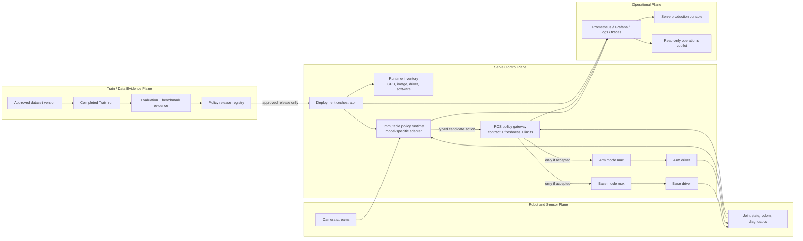
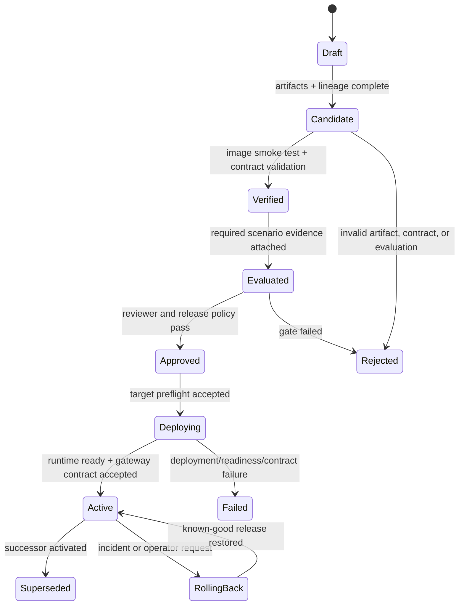
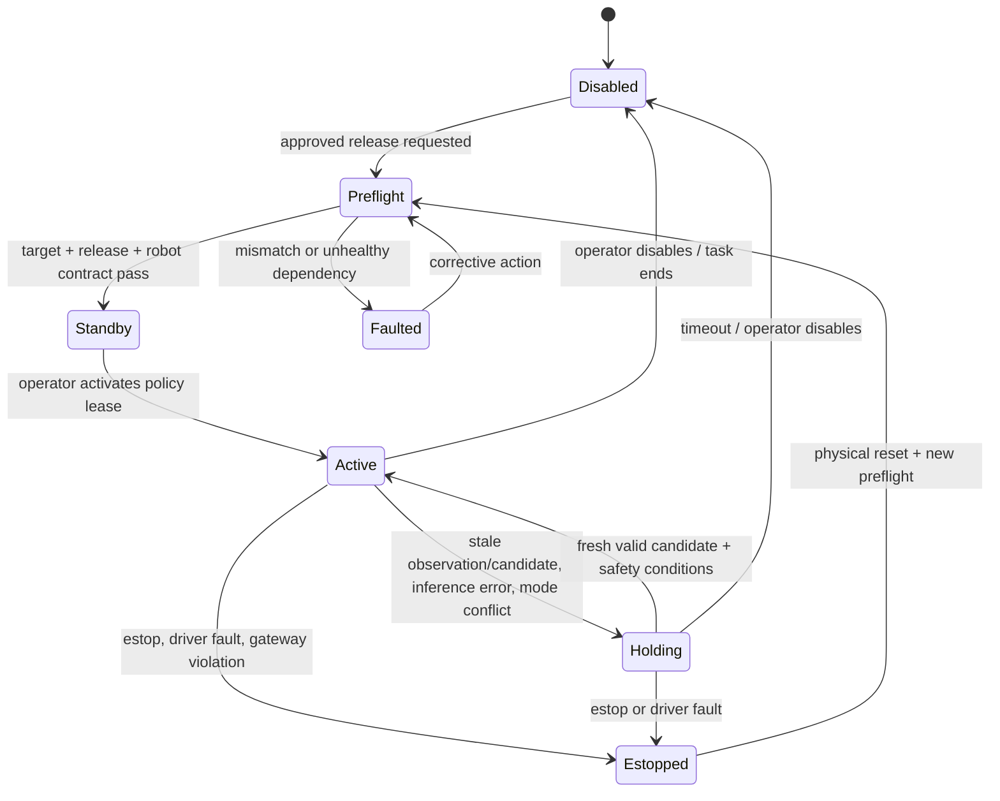

# 02 — Reference Architecture and Safety Model

**Status:** Proposed v1 reference architecture  
**Author:** Manus AI  
**Prepared:** 15 August 2026

## 1. Architectural decision

The canonical Serve product is a **policy-release runtime**, not a request/response demo. A policy is deployed only after Train has produced a complete evidence package and Serve has verified that the artifact can execute on a named target with the exact robot observation/action contract. The model adapter returns a typed candidate action; a deterministic ROS-side gateway decides whether that candidate can be forwarded to the base and arm command paths.

The v1 path should favour **co-located GPU runtime plus ROS-native policy execution** over a browser calling `/predict` for physical control. The FastAPI package remains useful for internal diagnostics, benchmark harnesses, development tools, and controlled server-to-server inference, but it is not the authority that activates robot motion. This uses the working ROS-native policy/mux topology instead of creating a parallel web-to-actuator path.[1] [2]



## 2. Runtime decomposition

| Component | Responsibility | Must not do |
|---|---|---|
| **Policy release registry** | Stores immutable approved releases, lineage, target compatibility, images, model/checkpoint digests, expected input/output contract, evaluation, reviewer approval, and rollback predecessor. | Load a raw model path or infer compatibility from a display name. |
| **Deployment orchestrator** | Reconciles desired release to an inventory target, starts a validated immutable runtime, waits for readiness, verifies contract, switches activation only after preflight, and records outcomes. | Directly publish base/arm commands. |
| **Model adapter** | Loads exactly one model family/release and converts current observations/instruction into a typed candidate action in the release-declared representation. | Interpret model text with regex, choose control mode, change hardware limits, or bypass gateway. |
| **ROS policy gateway** | Validates candidate action, profile, state/action schema, unnormalisation, joint/velocity/workspace limits, observation/action age, control lease, mode state, and estop. It produces a safe typed command or an explicit rejection/hold. | Run LLM planning, trust arbitrary HTTP clients, or assume the model is safety-certified. |
| **Base/arm mux and drivers** | Enforce exclusive routing and physical driver rules. | Depend solely on application-side validation for safety. |
| **Observability pipeline** | Makes release, inference, rejection, latency, command age, mux mode, driver state, incident, and rollback visible. | Invent metrics when a runtime is absent. |
| **Production console and agent** | Read real release/runtime evidence; request named deployment/activation/rollback capabilities through policy-controlled workflows. | Claim deployment/prediction success from local simulation or directly call robot topics. |

## 3. One canonical release contract

### 3.1 Policy release manifest

A release must be represented by a signed or content-addressed immutable record. The orchestrator accepts only `policy_release_id`, never `VLA_MODEL_PATH` selected by a UI field. Mutable aliases such as `latest`, unpinned Hugging Face revisions, or unverified local directory paths are development-only conveniences and prohibited on a physical runtime target.

| Manifest area | Required fields | Reason |
|---|---|---|
| **Identity** | `policy_release_id`, immutable semantic version, status, artifact/content digest, created time, owner/reviewer, signature or trusted registry identity. | Identifies exactly what is running. |
| **Lineage** | Train run ID, frozen dataset version + hash, code commit, container/image digest, adapter version, model base/checkpoint digest. | Connects runtime behaviour to reproducible evidence. |
| **Robot compatibility** | Robot profile ID/version, arm joint order/names, state/action schema, base kinematics/limits, frame convention, camera stream/preprocessor/calibration declaration. | Prevents valid model bytes being used on the wrong robot contract. |
| **Action semantics** | Action type/width, field names, absolute vs delta meaning, units, coordinate frame, normalisation/unnormalisation asset + digest, control rate, chunk semantics. | Makes candidate output safe to interpret. |
| **Runtime requirements** | Adapter family/version, CUDA/TensorRT/ONNX provider versions, GPU capability/VRAM, image digest, required ROS interfaces. | Blocks incompatible deployment targets. |
| **Evaluation evidence** | Evaluation scenario set, held-out success/failure taxonomy, safety/latency results, known limits, candidate/baseline comparison, approval policy. | Ensures release is evidence-led rather than loss-led. |
| **Rollback** | Compatible known-good predecessor, restore procedure/version, last successful deployment evidence. | Makes recovery an explicit feature. |

### 3.2 Release states



A model may be `Verified` without being eligible for a physical robot. Only `Approved` releases are deployable, and `Active` means both runtime readiness and gateway compatibility have been proven for the named target.

## 4. Model adapter contract

### 4.1 Typed observations and candidate actions

The current `/predict` schema permits opaque `config` and untyped dictionary actions. Replace it at the product boundary with typed messages. The exact transport can be in-process Python, ROS 2, gRPC, or a private HTTP endpoint; its safety semantics must remain the same.

```text
PolicyObservation
  release_id
  robot_profile_id + profile_digest
  session_id / correlation_id
  observation_timestamp
  camera frames or frame references + timestamps
  proprioception vector + schema/digest
  task/instruction + task ID
  preprocessing contract digest
  control mode and current safety state

CandidateAction
  release_id
  correlation_id
  produced_timestamp
  valid_until
  action_schema_id + width
  action_values
  representation (absolute_position | delta_position | twist | chunk)
  units / frame
  normalisation_contract_digest
  inference + preprocessing latency
  adapter/model identity
```

The gateway rejects a candidate if any identity, schema, timestamp, width, unit, normalisation digest, profile, enabled/mode, or sensor-freshness field disagrees with the activated release. Rejection is a first-class metric and audit event, not an internal exception.

### 4.2 OpenVLA-specific adapter rule

The upstream OpenVLA deployment example accepts a camera image and instruction, calls the model’s dedicated `predict_action()` method, and accepts an optional `unnorm_key` that chooses dataset statistics for output de-normalisation.[3] This matters: **OpenVLA action outputs must be interpreted through the release-declared training dataset statistics and target robot adapter**. They cannot be recovered reliably from generic model-generated text.

The current `OpenVLAModel` uses `generate()` and parses all numeric tokens by regex.[4] That implementation should be classified as experimental/debug-only and must be replaced with a model-specific adapter that:

1. builds the correct model prompt/preprocessor for the pinned upstream/model version;
2. invokes the official action prediction interface or an equivalently validated model-family API;
3. applies the release-pinned unnormalisation mapping and validates output dimensions;
4. maps the release action representation to the declared OmniBot gateway contract; and
5. returns no action when the model, contract, or observation is invalid.

No generic adapter may claim that OpenVLA, SmolVLA, ACT, Diffusion, and ONNX actions are interchangeable simply because each can be represented as `number[]`.

### 4.3 Adapter support tiers

| Tier | Adapter state | User-facing treatment |
|---|---|---|
| **A — supported on reference robot** | Container/release smoke tested, compatibility declared, evaluation evidence attached, gateway test passed, rollback tested. | Available for supervised deployment. |
| **B — experimental** | Adapter functions in simulation/benchmark but has incomplete physical evidence. | Explicitly experimental; cannot activate physical control by default. |
| **C — catalogue only** | Product metadata or future implementation exists but no working adapter/image contract. | Not selectable for deployment; no “deploy” or estimated-only success claims. |

At present, only the OpenVLA class skeleton exists in `packages/vla_serve`; the website’s SmolVLA, ACT, Diffusion, and custom entries must be treated as **C** until real adapters, image dependencies, and tests exist.[4] [5]

## 5. Deterministic policy gateway

### 5.1 Gateway order of operations

The gateway is the production control boundary. It receives candidate action messages only from a runtime identity associated with the active release and performs checks in this order:

1. Confirm hardware e-stop, driver/controller status, runtime state, and mode lease permit policy output.
2. Confirm candidate `release_id`, profile/schema/preprocessor/normalisation digests, action width, representation, and adapter identity match the active release.
3. Reject missing, stale, out-of-order, or future-dated observation/candidate timestamps beyond declared bounds.
4. Validate finite numeric values; convert units only through the release-declared mapping; verify field/range structure.
5. Apply independent base velocity, arm delta/joint/workspace, rate, and command-chunk rules.
6. Confirm exclusive base/arm ownership and that neither teleop, Nav2, RL, nor another policy owns the required channel.
7. Publish a gateway-stamped command to a dedicated policy source topic only if all checks pass.
8. Emit an allow/reject/hold decision event with correlation ID and reason code.

The current muxes select an active source but do not implement these checks, so the gateway must be added upstream of their selected policy input. It should default to **fail closed**: if model output or required state is absent, it produces no new command and drives the declared source-loss safe behaviour.[1] [2]

### 5.2 Base and arm handling

| Channel | Candidate representation | Gateway responsibilities | Downstream path |
|---|---|---|---|
| **Base** | Bounded twist or release-defined delta converted to twist. | Schema/frame/unit validation; per-axis limits; acceleration/jerk/rate rules; stale command timeout; mode lease; command age. | Dedicated `/cmd_vel/policy_gateway` source → base mux → driver. |
| **Arm** | Absolute joint target, bounded delta, or Cartesian goal only when release declares it. | Exact joint name/order; frame/transform validity; joint/step/rate/workspace limits; arm-enable state; collision/Servo policy; source freshness. | Dedicated `/arm/joint_commands/policy_gateway` or named Cartesian gateway action → arm mux/Servo → driver. |
| **Chunked policy** | Sequence plus per-step horizon/timing. | Reject chunks with wrong cadence/horizon; execute receding horizon under per-step checks; drop remainder on state/mode/safety change. | Gateway owns queue; mux never receives unvalidated full chunks. |

The policy runtime must not write the existing generic `/arm/joint_commands` topic directly in production. The profile mapping in `policy_node.py` is useful, but its current direct arm publish should be refactored to publish candidate actions or to call the gateway implementation in-process.[2]

### 5.3 Mode ownership and watchdogs



The mode lease must have an owner, scope (base, arm, or both), activation time, expiration/heartbeat, release ID, operator/session ID, and explicit revocation. Transitions must publish a zero/hold/disable command according to the hardware safety policy before a source switch. A 1 Hz feedback topic alone is not sufficient as a control safety mechanism.[1] [6]

## 6. Deployment architecture

### 6.1 One immutable runtime per release revision

The current FastAPI service supports hot mutation through `/load_model` of one process-global object.[7] For v1, deploy a new release as a separate immutable runtime revision instead:

| Step | Deployment action | Required proof |
|---|---|---|
| **Resolve** | Registry resolves release, image, adapter, checkpoint, normalisation asset, and target. | All digests/signatures and target requirements match. |
| **Stage** | Pull immutable image/artifacts to GPU target with model cache access. | Artifact checksums and sufficient storage/VRAM visible. |
| **Warm** | Start runtime with no policy control lease; load model and run a known observation fixture. | `/readyz`, adapter action contract, GPU utilisation, and expected candidate vector pass. |
| **Verify** | Run a gateway contract test against target profile without forwarding to drivers. | Valid fixture accepted; stale/mismatched/unsafe fixtures rejected with reason. |
| **Activate** | Operator requests mode lease after robot preflight. | Exclusive control ownership, estop state, sensors, and live runtime pass. |
| **Observe** | Runtime/gateway metrics and logs flow under release ID. | Dashboard/alerts report this exact release. |
| **Rollback** | Revoke lease, disable candidate source, restore approved predecessor, re-run readiness/gateway checks. | No gap in audit, source ownership clear, expected predecessor active. |

The deployment agent may initially use Docker Compose or systemd on one desktop. A Kubernetes/cloud control plane is not a v1 requirement. The important property is declarative desired release, observable reconciliation, and evidence—not the orchestration brand.

### 6.2 Container/image strategy

Build and test adapter-specific runtime images. The current `Dockerfile.vla` is intentionally a small FastAPI image and comments out the heavyweight OpenVLA dependencies; it cannot double as an untested universal model image.[8]

| Image class | Contents | Use |
|---|---|---|
| `serve-core` | API schemas, registry client, observability, gateway protocol utilities, no model framework. | Light control/diagnostic tools. |
| `serve-openvla:<digest>` | Pinned CUDA/Torch/Transformers/accelerate/bitsandbytes/OpenVLA adapter and compatible release artifact. | OpenVLA-specific benchmark or supervised runtime. |
| `serve-smolvla:<digest>` | Pinned LeRobot/SmolVLA dependencies and adapter. | Reference VLA runtime once Train produces compatible artifact. |
| `serve-onnx:<digest>` | ONNX Runtime/TensorRT/provider dependencies and policy adapter. | Low-latency RL or control benchmark runtime. |

Every image gets a GPU integration smoke test, software-bill-of-material inventory, model-load action fixture, and versioned compatibility record before it may support a release.

## 7. Service APIs and security

### 7.1 Separate service-facing and operational interfaces

| Interface | Role | Network/access posture |
|---|---|---|
| **Internal model adapter** | Candidate-action call from ROS policy runtime or internal gateway. | Local process, Unix socket, loopback, or private network only; service identity required. |
| **Runtime operational API** | `livez`, `readyz`, release metadata, metrics, controlled diagnostics. | Private network; read-only operator identity; no anonymous public exposure. |
| **Deployment API** | Create/reconcile/stop/rollback a named release. | Platform service identity plus explicit operator approval; asynchronous job receipts. |
| **Production UI/agent** | Reads release, runtime, health, benchmark, and audit records; requests named actions. | Authenticated user/project scope; no raw device endpoint input. |
| **Development playground** | Demonstrates HTTP action requests with synthetic scenes. | Explicitly isolated demo environment; cannot share robot credentials or gateway routes. |

For v1, bind model runtime ports to localhost or a secured private network and use a private tunnel or mutually authenticated service link where cross-host connectivity is required. API keys may be retained for local development but are not adequate as the sole production identity model. Default CORS must be deny-by-default; `*` with credentials is not an appropriate production default.[7]

### 7.2 Endpoint semantics

| Endpoint | Meaning | Success condition |
|---|---|---|
| `GET /livez` | Process/event-loop is responding. | It says nothing about model or robot readiness. |
| `GET /readyz` | Release runtime can serve valid candidates for its declared contract. | Model loaded; expected release artifacts/digests present; adapter fixture passes; dependencies/GPU ready. |
| `GET /release` | Immutable active/staged release identity and contract summary. | Returns digests/compatibility; no mutable raw path accepted. |
| `POST /candidate-action` | Internal request for a typed candidate action. | Valid request returns candidate with full identity/timing metadata—not a driver command. |
| `GET /metrics` | Runtime and gateway operational telemetry. | Includes release labels and never exposes prompts/images/raw secrets. |
| Deployment/activation action | Policy-controlled asynchronous task. | Requires named release, target, preflight, confirmation, and produces receipt/audit—not instant fabricated success. |

## 8. Observability and incident evidence

The existing monitoring stack already covers control-loop latency, estop state, VLA inference latency, GPU memory, Pi resources, mission failures, and metrics-bridge availability.[9] Add Serve-specific metrics that distinguish process, model, contract, and robot-control health.

| Metric family | Example dimensions | Why it matters |
|---|---|---|
| **Release/runtime state** | release ID, target, adapter, image digest, state, readiness reason. | Detects drift and proves what is active. |
| **Inference** | model load duration, preprocessing/inference/candidate latency, queue depth, errors, OOM/restarts. | Shows whether the runtime fits the control/task budget. |
| **Input contract** | sensor age, missing modality, profile/schema/preprocessor mismatch, invalid task/request. | Separates sensor/integration failure from model failure. |
| **Gateway decisions** | accepted/rejected/held action count, reason code, action age, limit clamp/reject, mode conflict, estop. | Makes autonomous control decisions auditable. |
| **Command/control** | mode lease state, owner, command age, watchdog trip, base/arm output rate, driver feedback. | Detects source-loss and ownership errors. |
| **Deployment** | stage/warm/verify/activate/rollback duration/outcome, release/target, artifact mismatch. | Turns deployment into an operationally measurable process. |
| **Outcome** | task success/failure, intervention, incident type, policy release/dataset/run. | Closes the loop back to Data and Train. |

Every action-related log/metric/event should carry a bounded `correlation_id` and the policy release ID. Do not log raw camera data, full prompts, API keys, or unbounded raw model text into general telemetry.

## 9. Relationship to the existing codebase

| Existing asset | Retain | Change |
|---|---|---|
| `packages/vla_serve` | FastAPI lifecycle, body limit, optional instrumentation, packaging structure, abstract model interface. | Make it canonical; remove generic action parsing; add typed release contract/readiness/adapter boundaries. |
| `vla_engine` | TensorRT-related utilities that prove reusable. | Stop maintaining a second HTTP server; migrate or deprecate duplicated endpoint implementation. |
| `policy_node.py` | Sensor acquisition, task/enable integration, optional diagnostics, multi-adapter direction. | Publish candidate actions to gateway; fail closed on loading/contract failure; add freshness/identity checks. |
| `cmd_vel_mux.py` / `arm_cmd_mux.py` | Source selection and existing driver route. | Feed from gateway-specific sources; implement control lease/source-loss/mode-transition policy around them. |
| Compose deployment | GPU reservation, cache mount, restart policy. | Add immutable image/release artifact mounts, private port posture, readiness gate, and deployment records. |
| Website Serve console | UX/visual configuration, response inspector, health probe, snippets. | Split sandbox from production console; bind production controls only to real registry/orchestrator APIs. |
| Agent Serve tools | Read-only estimates/catalogue concepts. | Replace static/fabricated write verbs with read-only evidence tools first; later invoke confirmed deployment capabilities. |

## References

[1]: ../../robot_ws/src/omnibot_hybrid/omnibot_hybrid/cmd_vel_mux.py "Current base command mux"
[2]: ../../robot_ws/src/omnibot_lerobot/omnibot_lerobot/policy_node.py "Current ROS policy node"
[3]: https://raw.githubusercontent.com/openvla/openvla/main/vla-scripts/deploy.py "Upstream OpenVLA deployment server"
[4]: ../../packages/vla_serve/vla_serve/models/openvla.py "Current generic-generation OpenVLA adapter"
[5]: ../../website/lib/serve/models.ts "Website Serve catalogue"
[6]: ../../robot_ws/src/omnibot_rl/omnibot_rl/arm_cmd_mux.py "Current arm command mux"
[7]: ../../packages/vla_serve/vla_serve/inference/server.py "Current HTTP server lifecycle and defaults"
[8]: ../../infra/docker/Dockerfile.vla "Current VLA server container image"
[9]: ../../infra/observability/prometheus/alerts/omnibot_alerts.yml "Current alerts"
