# 03 — Implementation Roadmap and Acceptance Plan

**Status:** Proposed 90-day delivery and verification plan  
**Author:** Manus AI  
**Prepared:** 15 August 2026

## 1. Delivery objective

Within 90 days, demonstrate a repeatable, supervised policy release on the OmniBot reference configuration: an immutable Train-approved artifact is registered, deployed to the GPU workstation using a validated adapter image, proven ready against a known fixture, activated through a policy gateway and explicit control lease, observed during a bounded task, and rolled back to a known-good release.

The deliverable is **evidence of controlled behaviour**, not a generic endpoint, a green health check, or a chart. It must be possible to answer: which policy produced this action, from which data/run/version, under which robot profile and limits, on which machine/image, with what sensor age and gateway decision, and how did the system recover when the policy failed?

## 2. Critical path

```mermaid
flowchart LR
    A[Freeze reference policy / robot contract] --> B[Repair canonical model adapter]
    B --> C[Build and pass immutable runtime image smoke test]
    C --> D[Create policy release registry + run manifest import]
    D --> E[Implement ROS policy gateway + mode lease]
    E --> F[Deploy/warm/verify orchestration]
    F --> G[Supervised activation + observability]
    G --> H[Rollback and incident drill]
    H --> I[Production console + read-only agent evidence]
    I --> J[External golden-path evaluation]
```

## 3. 90-day roadmap

### Phase 0 — Weeks 1–2: define truth and repair the inference contract

This phase removes the highest-risk ambiguity: numeric output is not a valid robot action unless its representation and provenance are explicit.

| Deliverable | Required work | Acceptance evidence |
|---|---|---|
| **Reference policy/robot contract** | Freeze `omnibot-quest3-so101@1.0.0`: input cameras/preprocessing, 9-D state/action semantics, arm joint names/order, base/arm limits, frames, control frequencies, synchronisation/freshness budgets, and physical task boundary. | Versioned schema validates a release fixture; all reference runtime components consume it. |
| **Canonical Serve decision** | Declare `packages/vla_serve` the canonical HTTP/package base; map or deprecate the duplicate `vla_engine` server. | One active roadmap/owner for endpoint code; duplicated server cannot silently diverge. |
| **Model adapter repair** | Remove generic `generate()` plus regex action parsing. Implement a model-family adapter using the validated upstream/model action API and release-pinned normalisation contract. | Unit fixture proves exact action shape and interpretation; missing/incorrect unnormalisation rejects rather than guesses. |
| **Typed candidate envelope** | Replace untyped `Dict[str, Any>` response at internal boundary with release/profile/schema/timestamp/action metadata. | Pydantic/ROS tests reject missing identity, wrong width, `NaN`, stale timestamp, unknown representation, or digest mismatch. |
| **Truthful UI/agent correction** | Put simulated console actions behind an unmistakable sandbox flag; remove or disable simulated deploy/stop/predict write capabilities in production path. | No product surface says “deployed”, “loaded”, or “inferred” without a persisted runtime/event receipt. |
| **Container baseline** | Split minimal core image from model-specific image; include actual pinned dependencies for one selected adapter. | GPU build/load/fixture test starts the exact published image and records image digest/versions. |

### Phase 1 — Weeks 3–4: policy release registry and runtime readiness

| Deliverable | Required work | Acceptance evidence |
|---|---|---|
| **Policy release manifest** | Implement identity, lineage, target compatibility, action semantics, runtime requirements, evaluation evidence, approval, and rollback fields. Import output from Train as candidate release. | Raw path/class is rejected; release creation requires complete hashable evidence. |
| **Release state machine** | Implement draft → candidate → verified → evaluated → approved → deploying → active/superseded/rollback transitions with immutable history. | Every state transition has actor, time, policy reason, linked evidence, and test. |
| **Readiness model** | Implement `/livez`, `/readyz`, `/release`, and release-labelled metrics. `/readyz` tests model load, asset digests, adapter fixture, GPU/dependency and declared contract. | Compose/deployer will not activate a runtime when merely live but not ready. |
| **Runtime inventory** | Record GPU identity/VRAM, driver/CUDA/container image, ROS interfaces, disk/cache, target profile, and software versions. | Deployment to incompatible GPU/image/ROS/profile is blocked before activation. |
| **Artifact integrity and provenance** | Materialise checkpoints, dataset-statistics/normalisation assets, and adapters by digest. | Modified/missing artifact fails warm-up with an explainable reason; registry retains known-good predecessor. |

### Phase 2 — Weeks 5–7: deterministic gateway and controlled deployment

| Deliverable | Required work | Acceptance evidence |
|---|---|---|
| **ROS policy gateway** | Implement candidate validation, sensor/action timestamps, normalisation/profile/schema checks, finite/range/limit checks, gateway-stamped command source, rejection reasons, and correlation IDs. | Valid fixture passes; each invalid/stale/mismatched case produces no driver command and a recorded reason. |
| **Mode lease and source-loss policy** | Add explicit base/arm ownership leases, activate/deactivate handshake, stale command watchdog, zero/hold policy, transition barrier, and estop integration. | Teleop/Nav2/RL conflict, runtime loss, input loss, estop, and mode switch behave predictably in simulation and tethered tests. |
| **Runtime deployment agent** | Implement desired release reconciliation for one GPU target: stage, warm, contract verify, activate, stop, rollback. Use Compose/systemd initially if fastest. | An activation creates a real deployment ID, target state, runtime endpoint, readiness report, and audit receipt. |
| **Deployment integration** | Route approved candidate action through gateway-specific base/arm topics, retain existing muxes/drivers as final downstream layers. | Runtime has no direct hardware topic write in production configuration. |
| **Failure handling** | Define OOM, adapter load failure, GPU loss, runtime crash, stale image, incompatible release, and network/DDS loss actions. | Fault injection enters hold/disabled state; alarm/reason/rollback procedure is observable. |

### Phase 3 — Weeks 8–10: evidence, real operational surface, and supervised proof

| Deliverable | Required work | Acceptance evidence |
|---|---|---|
| **Serve metrics and alerts** | Add release/runtime/gateway/input/command/deployment metrics and alerts; link existing VLA/GPU/control alerts to runbooks. | Dashboard can identify active release, p95 total latency, rejection reasons, command age, mux owner, and GPU pressure. |
| **Real production console** | Bind release selection, runtime inventory, deployment status, readiness, logs, metrics, activate/disable/rollback requests to persisted service records. | Browser refresh retains the exact same deployment/release state; sandbox UI is visually and technically isolated. |
| **Read-only agent surface** | Expose live release, readiness, metrics, incidents, benchmark results, and rollout status. | Copilot can answer “why is policy inactive?” from real evidence and has no raw ROS/model-load/deploy authority. |
| **Supervised physical evaluation** | Run a fixed scenario with physical operator, e-stop, task bounds, latency logging, gateway decisions, interventions, and rollback. | Evaluation record is attached to release and distinguishes model, gateway, sensor, and operator events. |
| **Rollback drill** | Deliberately force a controlled failure/threshold breach and restore known-good release. | Rollback time, final active release, ownership, and incident audit are recorded. |

### Phase 4 — Weeks 11–13: product proof and bounded operations

| Deliverable | Required work | Acceptance evidence |
|---|---|---|
| **Golden-path operator test** | A non-author follows documented release deployment, preflight, supervised activation, observation, disable, and rollback sequence. | Completion time, error count, support interventions, and confusing states are logged. |
| **External design-partner proof** | Run one bounded supervised task with an appropriate research/open-hardware user. | User completes or meaningfully evaluates the process; evidence changes product priority. |
| **One confirmed operational capability** | Add one named, human-confirmed action such as `request_activate_release` or `request_rollback_release`; preserve policy checks and receipt. | Invalid target/state/approval is rejected; valid request produces real orchestrator result; no generic command access exists. |
| **Public capability matrix** | Publish supported adapters/robots/tasks/constraints only from measured evidence. | Website, docs, UI, code, and benchmark records agree. |

## 4. Immediate two-week backlog

The following order matters. It prevents an attractive Serve console from advancing ahead of action semantics and safety evidence.

| Order | Ticket | Main code area | Acceptance criterion |
|---:|---|---|---|
| 1 | **Define `PolicyReleaseManifest` and reference profile contract** | New shared schema package; reuse Data/Train profile IDs. | Contains all fields in the architecture document; schema fixture includes 9-D OmniBot policy. |
| 2 | **Select the first supported adapter based on a real Train artifact** | Train output + Serve adapter decision record. | Choice is justified by actual input/action/model/runtime compatibility—not marketing catalogue. |
| 3 | **Replace generic OpenVLA numeric parsing** | `packages/vla_serve/.../models/openvla.py`. | Uses model-specific action API; rejects absent/different unnormalisation asset; tests known output contract. |
| 4 | **Create model-specific immutable image** | `infra/docker/` and package dependencies. | Image includes declared ML dependencies; GPU smoke test loads one real/small model fixture and records digest. |
| 5 | **Implement real `/livez`, `/readyz`, `/release`** | Canonical Serve runtime. | Compose readiness uses `/readyz`; model-unloaded/missing-digest/fixture-failure is not ready. |
| 6 | **Hide simulated production mutations** | Serve console, `mcp-tools.ts`, backend/inference modules. | Production UI cannot return simulated deployment/prediction success; sandbox clearly labels generated data. |
| 7 | **Implement typed `CandidateAction` plus gateway validation library** | Shared Serve/ROS package. | Unit tests cover `NaN`, wrong width, wrong profile, stale state/action, units/normalisation mismatch, and limits. |
| 8 | **Add gateway-specific command topics and mode lease** | ROS policy node, mux integration, gateway node. | Policy runtime cannot reach existing selected topics without active valid lease/gateway acceptance. |
| 9 | **Add source-loss watchdog and zero/hold semantics** | Gateway/mux/driver integration. | Runtime crash or delayed candidate leads to safe state inside declared budget. |
| 10 | **Run first tethered/low-risk runtime drill** | Hardware procedure + metrics. | Dated evidence contains preflight, deployment, candidate acceptance/rejection, control latency, mode transitions, estop, and rollback. |

## 5. Verification ladder

Every Serve change must pass progressively stronger evidence. The test scope becomes physical only after semantic and safety contracts pass.

| Level | Environment | Test scope | Exit condition |
|---|---|---|---|
| **L0: Unit and schema** | Python/C++/TypeScript test runners | Release-state transitions, manifest schema, hashes, unnormalisation mapping, candidate action fields, limits, timestamp arithmetic, UI truthfulness. | Deterministic CI tests pass. |
| **L1: Adapter contract** | Mocked or fixture model image | Prompt/preprocess/action API, known observation fixture, expected model output, model-load failure, malformed image/input. | Model adapter emits valid candidate or explicit failure—never guessed numeric vector. |
| **L2: Container/runtime** | GPU workstation with no driver activation | Image build, dependency availability, artifact pinning, model warm-up, liveness/readiness/release endpoints, concurrent load/predict constraints, metrics. | Runtime is ready only when actual declared release is loaded and fixture passes. |
| **L3: ROS gateway / digital twin** | ROS integration and Gazebo/Isaac/mocked driver | Sensor freshness, state/action compatibility, lease, mux ownership, source loss, command rejection, correlation tracing, release deployment/rollback. | Invalid candidate never reaches output command topic; valid candidate can be traced end-to-end. |
| **L4: Tethered or wheels-safe hardware** | Robot secured, marked workspace | Estop, gateway/mux switching, stale source, device/runtime loss, base/arm limits, command age, disable/rollback. | Measured safe state/recovery procedure passes with operator checklist. |
| **L5: Supervised task** | Reference task, operator present | Task evidence, runtime latency, intervention, incidents, health, rollback and known-good recovery. | Release gate has complete scenario evidence and can be reviewed. |
| **L6: Design partner** | Bounded external setup | Usability of deployment/preflight/interpretation/rollback documentation. | Evidence changes the product decision, not merely a demo impression. |

## 6. Core acceptance tests

### 6.1 Adapter and release tests

| Test | Setup | Expected result |
|---|---|---|
| **Pinned release load** | Load release whose image/model/normalisation digests match registry. | `readyz` passes and `release` exposes exact immutable identity. |
| **Artifact substitution** | Replace checkpoint or stats file without changing manifest. | Warm-up fails before candidate output; mismatch audit recorded. |
| **OpenVLA action semantics** | Feed a known image/instruction fixture through adapted upstream action API. | Candidate width/representation/normalisation contract matches fixture; raw text is not used as action parser. |
| **Unsupported catalogue adapter** | Select SmolVLA/ACT/Diffusion path without installed adapter/image. | Deployment is unavailable/rejected, not simulated as fit/deployed. |
| **Concurrent mutation attempt** | Request new model load while runtime serves active release. | Active runtime remains immutable; orchestrator stages a new revision rather than mutating active model. |
| **Model/adapter fault** | Induce load exception/OOM/dependency absence. | State becomes failed/not-ready; no policy lease; alert/audit explains cause. |

### 6.2 Candidate/gateway tests

| Test | Trigger | Expected result |
|---|---|---|
| **Wrong release/profile/schema** | Candidate has wrong digest, 8-D/10-D action, incorrect joint order, or different camera/preprocessor contract. | Gateway rejects; no command is published. |
| **Invalid numeric content** | `NaN`, infinity, empty vector, malformed representation, unnormalised action. | Gateway rejects with typed reason; runtime health/event counters update. |
| **Out-of-range action** | Candidate exceeds base/arm delta/joint/workspace policy. | Gateway rejects or applies the explicitly approved bounded transform; event states which. |
| **Stale or missing inputs** | Observation/action age exceeds release budget, camera/state unavailable, clock invalid. | Gateway enters hold/disabled state and does not forward new movement command. |
| **Mode lease conflict** | Teleop/Nav2/RL owns base/arm while policy activation requested. | Activation denied; active owner visible. |
| **Runtime disconnect** | Kill adapter process/DDS path during active policy. | Watchdog yields safe output; lease expires/revokes; recovery needs preflight. |
| **Estop** | Assert physical/system estop during active policy. | Driver/mux/gateway stop path takes priority and release activation remains blocked until reset. |

### 6.3 Deployment and rollback tests

| Test | Expected result |
|---|---|
| Target lacks required GPU/VRAM/CUDA/ROS dependencies | Deployment blocked before warm-up with exact compatibility reason. |
| Runtime reports liveness but model unloaded | Deployment status remains non-ready; policy mode cannot activate. |
| Valid approved release stages | Deployment creates immutable runtime revision, readiness proof, target binding, and metric labels. |
| Candidate evaluation fails post-deploy preflight | Release remains staged; no driver mode ownership changes. |
| Operator disables policy | Gateway/mux has safe mode transition; runtime can remain warm but loses motion authority. |
| Rollback request | Lease revoked, known-good revision passes readiness/gateway check, activation/audit complete. |
| UI/agent requests deploy/rollback | Returns asynchronous receipt tied to real deployment ID; no fabricated endpoint/state. |

## 7. Runtime evidence scorecard

| Metric | Baseline goal | Release-gate use |
|---|---:|---|
| **Image build + model warm success** | Establish per adapter/target. | A release cannot proceed without recorded exact image/model readiness. |
| **Candidate preprocessing/inference/gateway p50/p95/p99** | Measure separated stages for each task/profile. | Must fit declared control/task budget; no opaque aggregate-only latency. |
| **Input freshness / missing modality** | Measure camera/state age and quality. | Exposes whether failure is sensor/integration vs model. |
| **Gateway reject / hold rate by reason** | Establish safe baseline in simulation and hardware. | High/novel rejection rate blocks release and directs debugging. |
| **Command age / watchdog trips** | Measure control health. | Any unexplained trip blocks external activation. |
| **Mode ownership conflicts** | Track requested/denied transitions. | Validates multi-controller isolation. |
| **Runtime restart/OOM/model load errors** | Track per release/image/target. | Repeated instability blocks `Approved` status. |
| **Rollback time and outcome** | Measure controlled drill. | A release is not operational without demonstrated restoration. |
| **Task success / intervention / safety incident** | Task-profile-specific baseline. | Links Serve runtime evidence back to Train release suitability. |

All evidence must include policy release ID, Train run, dataset version, robot profile, adapter/image digest, hardware/software stack, target, scenario, operator, and date. A dashboard number without those labels is useful for debugging but insufficient for a release claim.

## 8. Ownership model

| Role | Accountable responsibility | Cadence |
|---|---|---|
| **Product/founder owner** | Keeps V1 boundary narrow, approves public claims, recruits design partner, conducts evidence review. | Weekly. |
| **ML/runtime engineer** | Adapter semantics, model images, artifact integrity, model warm-up, performance evaluation. | Daily during Phases 0–2. |
| **Robotics/safety engineer** | Gateway, mode lease, mux/driver integration, physical tests, estop/source-loss procedures. | Every gateway/physical change. |
| **Platform/full-stack engineer** | Release registry, deployment agent, inventory, real console/agent APIs, audit/identity/metrics. | Two-week vertical slices. |
| **Data/Train owner** | Ensures release input lineage, evaluation handoff, profile contract, and outcome feedback. | At each candidate/approved transition. |

One named **release owner** must be accountable for accepting/rejecting evidence and for confirming the known-good rollback target before physical activation.

## 9. Risk decisions

| Risk | Early indicator | Mitigation or stop trigger |
|---|---|---|
| Model action semantics are incompatible with OmniBot profile | Unnormalisation unknown, action widths/units unclear, adapter fixtures fail. | Stop physical serving; fix data/profile adapter before UI/cloud work. |
| VLA latency cannot meet useful control/task timing | p95 candidate-to-gateway exceeds declared budget or causes watchdog holds. | Restrict task/mode, use suitable model/adapter, or use ONNX RL as first Serve proof. Do not hide latency with buffering. |
| Gateway becomes bypassed by legacy topics | Model/website nodes retain direct generic command publish. | Enforce production namespace/ACL/launch topology; audit topic graph in CI. |
| UI/agent claims exceed backend reality | Synthetic metrics/endpoints reappear in production code. | Contract tests ensure all production status values originate from persisted records. |
| Container dependency/GPU drift | Build/load inconsistency across desktop targets. | Pin image digest, runtime inventory, smoke test; refuse unverified target. |
| Scope expands to cloud/fleet before local reliability | Time diverted to WebGPU/marketplace/API features. | Weekly golden-path review; no scale feature before full local release/rollback drill. |

## 10. Recommended first action

Start with a **Serve contract spike**, not an interface. Pick the first actual Train artifact that has a frozen dataset/profile lineage. Create its release manifest, build a matching adapter image with all real dependencies, and execute a known observation fixture through the model adapter. The output must become a typed candidate action and be rejected by tests when its profile, schema, normalisation asset, or timestamp is wrong. Only after that passes should the team connect it to a gateway and ROS control mode.

## References

[1]: ../../packages/vla_serve/vla_serve/models/openvla.py "Current OpenVLA adapter"
[2]: https://raw.githubusercontent.com/openvla/openvla/main/vla-scripts/deploy.py "Upstream OpenVLA action-serving reference"
[3]: ../../infra/docker/Dockerfile.vla "Current packaged container"
[4]: ../../packages/vla_serve/vla_serve/inference/server.py "Current HTTP server"
[5]: ../../robot_ws/src/omnibot_lerobot/omnibot_lerobot/policy_node.py "ROS policy execution"
[6]: ../../robot_ws/src/omnibot_hybrid/omnibot_hybrid/cmd_vel_mux.py "Base mode mux"
[7]: ../../robot_ws/src/omnibot_rl/omnibot_rl/arm_cmd_mux.py "Arm mode mux"
[8]: ../train-vr-teleoperation/03-implementation-roadmap-and-test-plan.md "Teach–Train delivery evidence plan"
