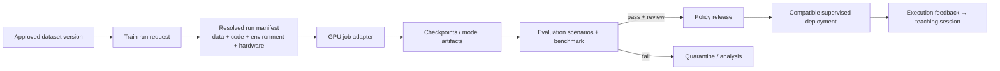

# 02 — Reference Architecture and Safety Model

**Status:** Proposed v1 reference architecture  
**Author:** Manus AI  
**Prepared:** 15 August 2026

## 1. Architectural principle

The system must be built as **three separated planes**. The first is the deterministic control plane, where Quest input is transformed into bounded control messages and handled by ROS controllers, muxes, drivers, and hardware safety. The second is the evidence and learning plane, which turns supervised interaction and execution records into immutable datasets, training runs, evaluation reports, and policy releases. The third is the AI context plane, which reads system state, diagnoses faults, summarizes evidence, and requests narrowly scoped high-level capabilities only after human approval.

This separation preserves operator agency, control-loop determinism, incident diagnosability, and an auditable boundary between advice and actuation. The external MR design’s key point—MCP/LLM for high-level reasoning and ROS control for deterministic action—is therefore a binding product rule, not a presentation preference.[1]

```mermaid
flowchart LR
    subgraph H[Human and MR Client]
        Q[Quest 3 / 3S\nOpenXR + Meta XR]
        U[Unity Pilot\ncontrols, passthrough, digital twin, UI]
        Q --> U
    end

    subgraph C[Deterministic Control Plane]
        RB[ROSBridge / typed bridge]
        G[Control gateway\ndeadman, mode, limits, watchdog]
        M[ROS command muxes\nbase + arm]
        R[Drivers and hardware\nYahboom + SO-101]
        U -->|bounded control at fixed rate| RB --> G --> M --> R
        R -->|state, images, diagnostics| RB --> U
    end

    subgraph E[Evidence and Learning Plane]
        S[Teaching session service\nshared session manifest]
        A[Artifact store\nraw ROS, VR sidecar, video, reports]
        D[Immutable Data Platform\nepisodes, quality, versions]
        T[Train orchestrator\nreal jobs + run registry]
        V[Evaluation and benchmark service]
        P[Policy registry and release gate]
        S --> A --> D --> T --> V --> P
        U -->|session events + XR metadata| S
        G -->|executed commands + safety events| S
        R -->|observations| S
        P -->|approved release only| G
    end

    subgraph I[AI Context Plane]
        B[Robotics capability broker]
        X[Read-only ROS / diagnostic adapters]
        L[AI copilot]
        L --> B --> X
        X -->|state, evidence, diagnostics| B
        B -. human confirmation + policy .-> G
        B -. read job/evidence .-> T
        B -. scene-editor capabilities only .-> U
    end
```

## 2. Build or reuse decision

The repository already contains a Unity Quest app using ROSBridge, profile-driven teleoperation, and a data recorder. The external Unity ROS Teleoperation project is a useful and current reference for Quest 3/OpenXR, ROS transport, spatial anchors, visualisation, and robot packaging, but it uses a different primary transport model and Unity version. Replacing the existing application wholesale would discard already-integrated login, garage, recording, profile, VR bridge, and control code while introducing a large migration surface.[2] [3]

| Approach | Benefits | Risks | Decision |
|---|---|---|---|
| **Harden the existing OmniBot VR app and selectively adopt components — recommended** | Keeps current Quest 3/Meta XR, ROSBridge, profile/control, recording, garage, and robot-specific knowledge. Limits work to the actual product gaps. | Requires disciplined refactoring and tests; some desired MR visualisation components must be adapted. | **Use as the v1 path.** |
| **Fork the Unity ROS Teleoperation project and port OmniBot into it** | Provides a broad set of Quest/OpenXR/ROS visualisation features and a newer Unity reference. | Requires ROS transport bridging/replacement, scene/app migration, package reconciliation, reimplementation of existing data/garage flows, and additional safety validation. | Run a short isolated compatibility spike only; do not make it the product baseline. |
| **Build a new MR application from scratch** | Full design freedom. | Recreates solved Quest/OpenXR/teleop work, delays evidence, and creates the highest test burden. | Reject for the current stage. |

The same rule applies to Open Teach and ROS2 MCP. Open Teach is valuable as a source of implementation patterns for VR demonstration collection, retargeting, and operator ergonomics. ROS2 MCP is valuable as a reference for read-only graph/diagnostic tooling. Neither should become an unreviewed production dependency in the actuation path.[4] [5]

## 3. Deterministic control plane

### 3.1 Control path

The Quest client must directly publish only a small, typed set of control messages through the existing ROS transport. The current `TeleopController` and 6-DOF manipulation scheme already make the right distinction: base/arm channels are selected from a robot profile, arm motion is disabled at session start, joint commands are clamped, and robot-side Cartesian target mode can be used when a tested MoveIt Servo path exists.[6] [7]

| Channel | Allowed producer | Required controls | Rate / timing principle |
|---|---|---|---|
| **Base teleoperation** | Active, authenticated human MR client only | Deadman semantics, fixed per-profile velocity limits, mux ownership, watchdog timeout, estop priority, connection-loss zero command. | Publish at a bounded rate; driver/mux remains the final authority. |
| **Arm joint teleoperation** | Active human MR client only for the SO-101 local-IK profile | Arm disabled by default, enable state visible, joint limits, per-step delta/rate limits, workspace envelope, hand-tracking loss hold/zero behaviour, estop priority. | Current target is 20 Hz; publish timing and age must be instrumented. |
| **Cartesian target teleoperation** | Active human client through an explicitly supported robot-side IK/Servo adapter | Workspace, transform validity, collision/scene validity where MoveIt is used, Servo halt on stale target, explicit mode ownership. | Robot-side planner/servo must reject invalid/stale target data. |
| **Autonomous policy output** | An approved policy runtime only | Compatibility lock, verifier, command mux mode, driver limits, metrics, emergency stop, rollback. | It must not share uncontrolled ownership with VR teleop. |
| **High-level capability** | Capability broker after operator confirmation | Typed parameters, preconditions, allowlist, policy check, execution receipt, audit event. | Asynchronous and non-real-time. |

### 3.2 Required teleoperation state machine

```mermaid
stateDiagram-v2
    [*] --> Disconnected
    Disconnected --> Connected: authenticated connection + profile selected
    Connected --> Preflight: operator starts session
    Preflight --> Ready: all safety / topic / camera / storage gates pass
    Preflight --> Faulted: any hard gate fails
    Ready --> TeleopActive: operator enables mode
    TeleopActive --> Recording: operator starts capture
    Recording --> TeleopActive: save or discard capture
    TeleopActive --> Estopped: e-stop, watchdog, link loss, fault
    Recording --> Estopped: e-stop, watchdog, link loss, fault
    Estopped --> Ready: physical clear + fault acknowledged + re-preflight
    TeleopActive --> Ready: operator exits mode; zero/disarm confirmed
    Ready --> Disconnected: user disconnects
    Faulted --> Preflight: corrective action + retry
```

No command may be emitted outside `TeleopActive` or `Recording`. `Estopped` is latched in the product state until the physical/system condition is cleared and a new preflight passes; a UI button alone cannot resume motion. The exact ROS driver/mux must still enforce final movement limits independently of this application state.

### 3.3 Control preflight

A preflight report is an evidence object, not a green cosmetic badge. It should include the selected profile/schema version, robot identity, ROS domain and topic freshness, camera stream availability, clock/time source, arm enable state, e-stop state, joint/velocity configuration, storage availability, network/jitter samples, policy mode, software/firmware/calibration IDs, and operator workspace confirmation. Failure of any hard field blocks teleop and training capture.

## 4. Teaching session architecture

### 4.1 One session ID across headset and robot

The existing headset recorder produces local JSONL from cached observations and outgoing commands, while robot-side components can observe post-mux executed actions and cameras. These must become two views of one **Teaching Session** rather than two unrelated recordings.[8] [9]

| Artifact | Source | Role | Required metadata |
|---|---|---|---|
| **XR input sidecar** | Quest client | Operator intent: hand/controller pose summaries, input mode, requested arm/base commands, XR tracking quality, UI events. | Session ID, app/build, headset, user, robot profile, coordinate frames, timestamp source, privacy flag. |
| **Executed-control record** | ROS post-mux topics | What deterministic control actually sent toward hardware. | Session ID, source/mux mode, topic QoS, command timestamps, command age, estop/mode transitions. |
| **Robot observation record** | ROS sensors/state | State, camera/video, odometry, joint state, diagnostics, safety events. | Topic contract, calibration/firmware, synchronisation diagnostics, sensor coverage, artifact hashes. |
| **Session manifest** | Teaching session service | Canonical provenance and closure record. | All identities/config hashes, start/end, task label, operator declarations, artifact list, incidents, upload/quality state. |
| **Data-quality report** | Data Platform | Decision basis for accepting the episode. | Structural results, coverage, timing alignment, invalid frames/commands, reviewer decision, policy version. |

The headset must stop attempting to create a standalone training dataset. Its JSONL is valuable as a sidecar for user-intent analysis and training-data troubleshooting, but VLA-ready data should be materialised from the Data Platform’s validated ROS-backed multimodal session record. If the sidecar is used as a learning signal, it must be explicitly labelled as **requested action**, not conflated with executed action.

### 4.2 Upload protocol

Replace the current unauthenticated `POST /upload_episode` byte drop with a resumable, authenticated session protocol:

1. The MR client requests a capture session after preflight and receives a session ID, short-lived upload credential, profile/schema declaration, and policy version.
2. The client records locally and appends a sequence-numbered sidecar stream; it does not block control on upload.
3. On closure, it uploads chunks with content hash, byte count, sequence number, idempotency key, and session ID. It may retry safely after app/network failure.
4. The robot-side session agent associates ROS bags/recordings using the same session ID and finalises an artifact manifest.
5. The Data Platform validates required streams, timing, modality coverage, safety incidents, and schema compatibility before exposing a candidate episode.

In development, this can run over a private local network, but the API should still require an authenticated capability token and bind every upload to an authorised project/robot/session. In production, use encrypted transport or a secured tunnel; no unauthenticated listener should bind to all interfaces.

## 5. Train architecture: from framework to product

### 5.1 Keep one canonical dataset boundary

The Train platform should consume only an **immutable Data Platform dataset version**. Its run manifest references the data version plus resolved artifact hashes; it does not take arbitrary path strings from a browser. The learning engine’s replay store can remain a valuable experiment/continual-learning source, but it must be converted through a tested adapter or treated as a separate source with explicit provenance.[10] [11]

### 5.2 Train run contract

| Contract field | Required value | Purpose |
|---|---|---|
| `run_id` | Immutable UUID | Correlates UI, logs, artifacts, and audit events. |
| `dataset_version` | Immutable ID + manifest/content hash | Prevents mutable or ambiguous input. |
| `profile_compatibility` | Robot profile/schema/image preprocessor declaration | Prevents 9-D/action/camera mismatches. |
| `trainer` | Explicit adapter and version | Distinguishes BC, SmolVLA, OpenVLA, RL, and test modes. |
| `model_config` | Base checkpoint, hyperparameters, seed, scheduler, augmentation | Makes the run reproducible. |
| `environment` | Container/venv lock, code commit, CUDA/driver, host/GPU profile | Explains performance and repeatability. |
| `artifacts` | Logs, metrics, checkpoints, evaluation outputs, hashes | Provides evidence and recovery. |
| `evaluation_policy` | Scenario set, holdout rule, pass/fail thresholds | Prevents release on loss alone. |
| `approval` | Named reviewer, release policy, timestamp | Keeps model deployment intentional. |

### 5.3 Working adapters before broad model support

The product should initially expose only adapters that pass a small real smoke test. First, repair the VLA fine-tuning adapter to map the learning-engine contract onto the actual `lerobot_engine/train.py` interface. Second, choose either an implemented replay-to-LeRobot converter or the Data Platform materialisation as the canonical VLA input; do not leave both pathways partially supported.[11] [12]

The product may then expose model families progressively: SmolVLA for the reference teaching loop; one simple behavioural-cloning baseline for debugging data quality; and RL only for separate simulation experiments. Presenting every registry name as an equally supported cloud option would repeat the current active-catalogue credibility problem.

## 6. Policy evaluation, release, and deployment

### 6.1 Evaluation is more than training loss

A policy candidate needs a held-out evaluation protocol. At minimum, the reference task must vary object pose and at least one nuisance condition, must distinguish human intervention from autonomous completion, and must record failure taxonomy and recovery. Simulation should run first, but physical results under supervised low-speed conditions are required before a policy can be presented as deployable.

| Gate | Required evidence | Reject when |
|---|---|---|
| **Data gate** | Validated immutable version, held-out split, coverage/quality report, provenance complete. | Data is mutable, missing modalities, or split leaks sessions. |
| **Run gate** | Successful job completion, model/checkpoint hash, real metrics, environment/config, no fatal data error. | Run status is simulated, artifact is missing, or inputs cannot be resolved. |
| **Evaluation gate** | Fixed scenario results, success/failure taxonomy, intervention count, latency/health, comparison to baseline. | Success is inferred from loss only or evaluation context is absent. |
| **Compatibility gate** | State/action dimensionality, camera streams, preprocessing, profile, safety limits, runtime package match. | Any model/runtime contract diverges from target robot. |
| **Release gate** | Human review, limitations, known-good rollback target, policy/card manifest. | Approval, rollback, or safety disclosure is absent. |
| **Deployment gate** | Fresh preflight, controlled mode ownership, operator present, estop verified, observed health. | Teleop/autonomy control ownership is ambiguous or safety state is bad. |

### 6.2 Defence in depth

`InferenceVerifier` is a useful layer: it rejects candidate action sequences exceeding base velocity, arm delta, joint-range, or simple reachability constraints and has a zero-policy fallback.[13] It must sit **in addition to**, not in place of, hardware drivers, ROS command muxes, arm limits, e-stop, controller watchdogs, collision checks, and operational supervision.

## 7. AI/MCP capability model

### 7.1 Read-only first

The first AI copilot release should be diagnostic. It can explain telemetry, controller state, topic rates, current profile/mode, recorded safety events, capture quality, training-job status, evaluation evidence, and policy-release compatibility. A ROS 2 MCP reference project exposes many useful introspection patterns, including topic monitoring, image retrieval, interface analysis, and live health monitoring.[14]

However, an MCP server is not a safety boundary. The OmniBot implementation must wrap every tool behind a robotics **capability broker** that enforces identity, project/robot scope, read-only vs write permission, precondition checks, confirmation, rate limiting, audit logs, and output redaction.

### 7.2 Capability tiers

| Tier | Examples | Default access | Required protection |
|---|---|---|---|
| **R0: Read-only diagnostics** | Robot state, controller status, battery, joint state, topic rate/latency, camera status, TF summary, job status, benchmark report. | Available to authorised operator/copilot. | Query limits, sensitive-data filtering, read audit. |
| **R1: Non-motion operational requests** | Prepare capture session, collect logs, switch UI camera, open an evaluation report, create simulation scenario draft. | Explicit user command or UI action. | Named capability, project scope, idempotency, audit. |
| **R2: Safety-relevant configuration request** | Request teleop mode, request velocity-limit change, request workspace update, request arm enable, request policy deployment. | Disabled by default. | Current state shown; dual confirmation from user + policy/preflight; bounded parameter schema; expiry; audit receipt. |
| **R3: High-level robot task request** | Request `home_robot`, `navigate_to`, or `move_arm_to_pose` through a tested named action. | Deferred until R0–R2 evidence exists. | Planner/controller capability, environment preconditions, physical-zone policy, confirmation, clear cancellation, execution monitor. |
| **Forbidden** | Raw actuator publishes, arbitrary ROS service invocation, arbitrary parameter mutation, e-stop clear by model, uploading arbitrary model weights. | Never exposed to AI. | Enforced by absence from tool registry and gateway ACL. |

The AI can ask: “The arm is disabled because a watchdog trigger followed a stale controller connection. The workspace now appears clear. Do you want to run preflight and request teleop enable?” It cannot autonomously publish arm targets or resume hardware merely because it has inferred a cause.

## 8. Unity MCP and digital twin scope

The existing Unity project declares a Unity MCP package, while the external reference project provides useful patterns for XR visualisation, robot models, spatial anchors, and ROS-linked data.[2] [3] In v1, Unity MCP should be limited to **development-time/editor capabilities** in a separate environment: scene inspection, diagnostic panel generation, simulation test scaffolding, and non-production visualisation changes.

Live Quest applications must not allow an AI agent to modify scenes, bindings, limits, or code while a physical robot is armed. Any generated change belongs in source control, goes through standard Unity/ROS tests, and is deployed as a signed/reviewed application build.

## 9. Non-functional requirements

| Concern | v1 requirement |
|---|---|
| **Control latency** | Establish and publish p50/p95 input-to-ROS-command and command-to-observed-motion measurements on the reference profile. AI traffic cannot share the control thread or cause control back-pressure. |
| **Failure recovery** | Link loss, headset app crash, agent crash, sensor loss, upload interruption, training worker failure, and evaluation failure each have explicit safe state and recovery procedure. |
| **Observability** | Every session, job, release, deployment, and AI capability call has correlation ID, actor, timestamps, outcome, and linked artifacts. |
| **Data integrity** | Artifact hashes, resumable/idempotent uploads, immutable training inputs, session-aware splits, and persistent quality decisions are required. |
| **Privacy** | XR/robot video, room imagery, operator movement data, robot IP/topology, and task labels are project-scoped sensitive data. Public export requires affirmative review. |
| **Compatibility** | Profile version, state/action schema, camera/preprocessing contract, robot calibration, and runtime versions must be checked before teleop capture is admitted to Train or a policy is deployed. |

## References

[1]: Supplied document: *AI-Native Mixed-Reality Robot Teleoperation with Unity + MCP*.
[2]: ../../vr_app/Packages/manifest.json "Current Unity, XR, WebSocket, and MCP package baseline"
[3]: https://github.com/leggedrobotics/unity_ros_teleoperation "Unity ROS Teleoperation project"
[4]: https://github.com/aadhithya14/Open-Teach "Open Teach project"
[5]: https://github.com/LCAS/ros2_mcp "ROS2 MCP project"
[6]: ../../vr_app/Assets/Scripts/Control/TeleopController.cs "Profile-driven teleoperation controller"
[7]: ../../vr_app/Assets/Scripts/Control/Manip/HandIK6DofScheme.cs "Hand-IK control and enable/limit handling"
[8]: ../../vr_app/Assets/Scripts/Recording/ProfileDrivenRecorder.cs "Headset-side recording"
[9]: ../../learning_engine/ros2/episode_logger_node.py "ROS execution logging"
[10]: ../data-platform/02-architecture-and-feature-plan.md "Data Platform immutable lifecycle and manifest"
[11]: ../../learning_engine/data/replay_dataset.py "Replay dataset and missing LeRobot export"
[12]: ../../learning_engine/policies/trainers.py "Fine-tuning adapter"
[13]: ../../learning_engine/verification/verifier.py "Policy verification and fallback"
[14]: https://github.com/LCAS/ros2_mcp "ROS2 MCP diagnostics reference"
