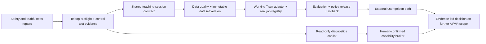

# 03 — Implementation Roadmap and Test Plan

**Status:** Proposed 90-day delivery and verification plan  
**Author:** Manus AI  
**Prepared:** 15 August 2026

## 1. Delivery objective

Within 90 days, prove one supervised, reproducible **Quest 3 teach → Train → evaluate → deploy** loop on the OmniBot reference system. The proof is not a polished dashboard or an AI chat demo. It is an external user completing a documented workflow whose teleoperation session, dataset version, training run, evaluation result, policy release, deployment, safety events, and rollback are traceable.

The order is intentional: first correct unsafe/untrue product surfaces and validate deterministic teleoperation; then integrate session-quality data; then make training/deployment real; then add a read-only AI copilot. MCP and autonomous task execution are deliberately late because they do not improve the fundamental data/control reliability problem.

## 2. Critical path

## 3. 90-day roadmap

### Phase 0 — Weeks 1–2: establish truthful, safe foundations

This phase fixes credibility and control-risk blockers before adding new surface area.

| Deliverable | Required work | Completion evidence |
|---|---|---|
| **One supported Pilot profile** | Freeze `omnibot-quest3-so101@1.0.0`: topics, arm/base schema, camera contract, joint/velocity/workspace limits, expected controller/mux modes, calibration and software fields. | A machine-readable profile validates against a known robot configuration and is the only profile selectable in production mode. |
| **Safe teleop state machine** | Implement connected/preflight/ready/active/recording/estopped transitions; add link-loss zero/disarm behaviour; expose ownership/mode and watchdog state. | Automated state transition tests plus a hardware test showing link loss ends in a safe state. |
| **E-stop and arm-enable verification** | Instrument both-grip e-stop, thumbs-up arm enable, arm disable, mode exit, tracking loss, and recovery. | Test report records trigger-to-command-stop latency, observation of controller state, and required reset steps. |
| **Train product truthfulness correction** | Replace simulated buttons/tool descriptions with “demo mode” labels until real backend jobs exist, or hide unsupported actions. | No production UI or agent tool reports a run/export/deployment that did not occur. |
| **Repair SmolVLA adapter** | Align `FineTuneTrainer` with actual `lerobot_engine/train.py` arguments; correct train-loop control flow if still unpatched; create an explicit output/run manifest. | A small known dataset executes through the adapter, produces a checkpoint, and records actual command/environment/artifacts. |
| **Define the VR session contract** | Specify shared session ID, manifest, XR sidecar, ROS source recordings, quality outputs, and privacy/retention policy. | Contract schema and a fixture validate; a test session has all required fields. |

### Phase 1 — Weeks 3–4: make a real teaching session

| Deliverable | Required work | Completion evidence |
|---|---|---|
| **Preflight UI and agent** | Read live ROS/robot/telemetry state to report required topics, camera freshness, storage, time base, mode, estop, arm state, and limits. | Capture cannot start when a hard preflight condition fails; test covers every hard condition. |
| **Session-aware recorder** | Add session manifest/sequence/timing/integrity to headset recording; record tracking quality, control mode, requested commands, XR events, safety events. | Headset restart/network interruption cannot silently lose closed session metadata. |
| **ROS capture association** | Have a robot-side agent start/stop or correlate the ROS data path with the same session ID. Capture executed commands, state, cameras, diagnostics, and estop. | Requested and executed commands can be compared for one complete session. |
| **Secure upload and staging** | Replace raw upload with authorised session handoff, schema/size/hash checks, resumable chunks, idempotency, staging directory, audit events. | Duplicate/replayed upload is harmless; malformed/unauthorised file is rejected; no production listener accepts anonymous writes. |
| **Data candidate handoff** | Send final session artifacts into the Data Platform’s validation/curation path, retaining XR data as a sidecar. | A real VR demonstration appears as a quality-scored candidate episode linked to raw artifacts. |

### Phase 2 — Weeks 5–7: make Train real

| Deliverable | Required work | Completion evidence |
|---|---|---|
| **Canonical input choice** | Select one VLA input path: immutable Data Platform LeRobot materialisation, or implement/test replay-to-LeRobot export. | Documentation and code expose one supported input route; no ambiguous “export later” pathway remains. |
| **Train job service** | Implement persistent job queue/state, run manifest, log/artifact handling, cancellation semantics, worker heartbeat, and failure classification. | The Train console lists real queued/running/failed/completed jobs after refresh/restart. |
| **Real console and tool integration** | Bind configuration, run launch, curves, GPU telemetry, logs, checkpoints, and stop/cancel to persisted API records. | Browser and agent surfaces return the same run IDs/states/artifacts; no generated metrics in production mode. |
| **Evaluation harness** | Define simulator-first and supervised physical scenario tests for the single task; collect intervention, task completion, collision/safety, runtime, and recovery metrics. | A candidate cannot become a policy release without completed evaluation record. |
| **Policy registry** | Register artifacts with data/run/environment/profile/preprocess/evaluation lineage, release state, and known-good rollback. | Attempted deployment with a mismatch or missing evidence is rejected. |

### Phase 3 — Weeks 8–10: deploy safely and prove usability

| Deliverable | Required work | Completion evidence |
|---|---|---|
| **Controlled deployment workflow** | Integrate the registry with existing policy nodes/serving path, mux ownership, supervised activation, live health, and one-step rollback. | A named approved policy is deployed to the compatible reference robot and rolled back under observation. |
| **Benchmark evidence** | Measure preflight time, control latency/jitter, e-stop/link-loss behaviour, session quality, upload reliability, data-to-run latency, train duration, inference/loop latency, and task success. | Results include hardware/software/profile/config/commit/artifact context and are stored as machine-readable evidence. |
| **Read-only AI copilot** | Implement a read-only capability broker over ROS/Train/Data diagnostic adapters, source-linked answers, and data-access audit log. | It can answer “why did the robot stop?” from evidence without any write/actuator capability. |
| **Golden-path quickstart** | Test documented setup with an internal non-author, capture, train, evaluate, deploy, and rollback. | Completion time, support interventions, and failures are recorded. |

### Phase 4 — Weeks 11–13: external proof and bounded actions

| Deliverable | Required work | Completion evidence |
|---|---|---|
| **Design-partner session** | Run the golden path with one research/open-hardware user under a bounded supervised task. | User completes material portions without the author driving the process; issues enter a prioritised decision log. |
| **Pilot packaging** | Define support scope, robot profile, task, data rights, acceptance test, safety limits, compute terms, and response boundaries. | A paid or committed pilot can be discussed without promising unbuilt fleet/autonomy capabilities. |
| **R2 capability prototype** | Add a single human-confirmed capability such as `request_teleop_mode` or `request_home_robot`, with all preconditions and receipt. | The action is refused under invalid state, logs intent/approval/result, and never gives raw ROS publish access. |
| **Public evidence update** | Publish only measured supported behaviour, capability matrix, limitations, and reproducible benchmark configuration. | Website, documentation, source code, and demo evidence agree. |

## 4. First two-week ticket backlog

This is the recommended starting sequence. Do not begin Unity scene generation, broader robot profiles, market features, or an AI command layer while these blockers exist.

| Order | Ticket | Primary files/components | Acceptance criterion |
|---:|---|---|---|
| 1 | **Create the reference robot/XR profile** | New versioned profile schema; existing `RobotProfile`, Data profile, and ROS config. | Contains exact topics, action/state dimensions, limits, cameras, transforms, control rates, and preflight requirements for OmniBot/SO-101/Quest 3. |
| 2 | **Repair the Train fine-tuning invocation** | `learning_engine/policies/trainers.py`, `lerobot_engine/train.py`, tests. | Adapter command matches actual CLI; smoke test produces a verified run manifest and checkpoint. |
| 3 | **Decide and implement one train-data adapter** | Data Platform manifest/materialisation or `ReplayDataset.export_lerobot`. | A frozen approved dataset version can be loaded by the selected trainer without manual folder edits. |
| 4 | **Add an explicit Train run model** | New job/run/policy data schema and backend API. | A run is durable across browser refresh and captures real—not simulated—state. |
| 5 | **Put the Train UI and MCP tools in truthful mode** | `TrainConsole.tsx`, `training.ts`, Train tools. | Unsupported controls are unavailable or explicitly labelled as demo; production handlers cannot fabricate success. |
| 6 | **Instrument control state transitions** | `TeleopController`, relevant drive/manip schemes, ROS bridge/mux monitoring. | A time-stamped stream records connection, preflight, arm enabled, active control, recording, estop, and recovery transitions. |
| 7 | **Add link-loss and tracking-loss safety tests** | Unity tests/simulation harness plus hardware procedure. | Command output falls to a safe state inside a declared budget; recovery requires re-preflight. |
| 8 | **Replace unauthenticated VR upload** | `vr_recording_bridge.py`, headset export client, session API. | Upload rejects missing/invalid credentials/session/hash/schema; legitimate retry is idempotent. |
| 9 | **Create the shared teaching-session manifest** | VR recorder, ROS agent, Data Platform ingestion. | One session links headset sidecar, ROS artifacts, profile/calibration, task, operator, timings, and safety events. |
| 10 | **Capture first baseline evidence** | Benchmark harness and test procedure. | At least one dated control/capture/training baseline has full context and an explicit limitations report. |

## 5. Verification ladder

No physical robot feature should jump directly from Unity Editor to external use. Every change advances through the following ladder.

| Level | Environment | What is tested | Exit condition |
|---|---|---|---|
| **L0: Unit** | C#/Python test runner | Profile parsing, coordinate transforms, limit clamping, state machine, manifest schema, hashing, command construction, Train adapter CLI. | Deterministic tests pass in CI. |
| **L1: Component simulation** | Unity PlayMode / mocked ROS / local fake job worker | Input-to-message mapping, estop state, recording lifecycle, upload retry, console state, policy gate logic. | No hardware required; fault paths tested. |
| **L2: Digital twin / ROS integration** | Gazebo/Isaac/ROS workspace | Topic QoS, mux ownership, robot-side IK target semantics, time alignment, scenario evaluation, capability broker preconditions. | Recorded artifacts and telemetry match contract. |
| **L3: Bench hardware** | Robot tethered or wheels lifted, clear workspace | E-stop, link loss, zero/disarm, camera freshness, joint/state constraints, upload/recovery. | Explicit operator checklist and measured response results pass. |
| **L4: Supervised task** | Marked physical workspace, operator present | The one task, data quality, Train run, evaluation, approved deploy, rollback. | Repeated complete golden-path runs satisfy release gate. |
| **L5: External user** | Bounded design-partner setup | Documentation usability, support burden, first-run success, actual value/failure feedback. | User evidence informs next product decision. |

## 6. Core test matrix

### 6.1 Teleoperation safety tests

| Test | Trigger | Expected system response | Required evidence |
|---|---|---|---|
| **Controller/client disconnect** | Kill MR WebSocket or disable headset network while active. | Base command zeros, arm disables/holds safely according to driver policy, state changes to estopped/faulted. | Timestamped logs plus observed command/controller state. |
| **Hand tracking loss** | Occlude or disable tracked hand while arm enabled. | New arm targets stop; system enters declared hold/disable policy; no stale target persists beyond watchdog. | Command age and joint behaviour trace. |
| **Both-grip e-stop** | Activate during base/arm motion. | E-stop reaches driver/controller, command path is inhibited, UI indicates latched state. | Trigger-to-stop latency and reset procedure. |
| **Mode conflict** | Attempt teleop while autonomous/policy mode owns mux. | Preflight/action is rejected until exclusive ownership is resolved. | Mux mode record and error response. |
| **Limit breach request** | Hand target exceeds workspace or model action exceeds profile limits. | Target clamps/rejects; event is logged; no out-of-range actuator command passes. | Input/command/controller trace. |
| **Stale pose/clock issue** | Inject old/out-of-order timestamp or transform invalidity. | Target is rejected; session quality reports timing issue. | Failure reason and safe state. |

### 6.2 Teach/data tests

| Test | Expected outcome |
|---|---|
| App restart during recording | Local manifest and buffered sidecar recover cleanly; incomplete session is marked rather than silently treated as complete. |
| Network interruption during export | Upload retries with idempotency; no duplicate episode or metadata collision. |
| Tampered JSONL / wrong profile | Receiver rejects with machine-readable schema/profile/hash reason. |
| ROS camera loss during session | Candidate episode fails or quarantines under explicit coverage policy; no black/empty data is silently accepted. |
| Requested vs executed command divergence | Session report exposes divergence and timing so training eligibility can consider it. |
| User rejects episode | Raw artifacts are retained per policy; candidate excluded from dataset version; audit event persists. |

### 6.3 Train/release tests

| Test | Expected outcome |
|---|---|
| Immutable data dependency | Train job rejects mutable path/no manifest; accepted job records exact input hash. |
| Fine-tune integration smoke test | Adapter launches actual supported command and registers output artifact. |
| Run interruption | Job records failed/cancelled state, preserves permitted checkpoint/logs, and never creates an approved release. |
| Compatibility mismatch | 9-D action/camera/profile/preprocess mismatch blocks policy release/deployment. |
| Evaluation below threshold | Policy remains candidate/quarantined; no export-to-Serve action is enabled. |
| Deployment rollback | Operator selects known-good release; runtime returns to it with auditable event. |
| Agent write attempt without confirmation | Capability broker refuses; no ROS mutation occurs. |

## 7. Metrics and evidence scorecard

| Metric | Baseline target in first month | Day-60 target | Product decision supported |
|---|---:|---:|---|
| **Teleop preflight pass rate** | Measure internal baseline | ≥80% for documented setup | Is the hardware/profile onboarding viable? |
| **Control latency / jitter** | Establish p50/p95 per segment | No unexplained regression | Is MR control safe/useful enough for demos? |
| **E-stop/link-loss response** | Measure every critical path | Repeatable within declared safety budget | Can the app be used outside developer-only testing? |
| **Teaching-session quality pass rate** | Measure first batches | ≥70% intended demos pass | Is operator capture producing trainable data? |
| **Dataset-to-real-training-run completion** | One working run | ≥3 reproducible runs | Is Train a product or a script collection? |
| **Policy evaluation success** | Establish task baseline | Improved relative to declared baseline | Does the loop create value beyond data collection? |
| **Successful supervised deployment/rollback** | One internal | ≥3 repeatable | Is release control operationally safe? |
| **Time from teleop session to evaluated candidate** | Measure | Downward trend | Is the workflow usable to an external developer? |
| **External workflow completion** | 0–1 observation | Two users or one committed pilot | Should research/open-hardware remain the immediate wedge? |

Every number must state the task, robot profile, hardware/software versions, calibration, operator, data/policy artifact versions, environmental conditions, and known limitations. Do not advertise an aggregate “success rate” that mixes different tasks, versions, or levels of intervention.

## 8. Ownership model

| Role | Accountable responsibility | Suggested cadence |
|---|---|---|
| **Product/founder owner** | Scope control, design-partner discovery, public claim approval, weekly evidence decisions. | Weekly. |
| **XR/teleop engineer** | Quest client, state machine, control UX, PlayMode tests, headset performance, input/recording sidecar. | Daily in Phases 0–2. |
| **Robotics/safety engineer** | ROS gateway/mux interaction, arm/base safety, preflight, hardware test protocol, execution recording, rollback. | Every physical test window. |
| **ML/data engineer** | Dataset contract, Train adapter, job manifests, evaluation, policy release logic, benchmark analysis. | Continuous from Phase 0. |
| **Platform/full-stack engineer** | Persisted job/session/release APIs, secure artifact transfer, real console and tool integration, audits/identity. | Two-week vertical slices. |

One named **golden-path owner** must reject work that does not advance a completed teleop session into a trustworthy evaluated policy release.

## 9. Risks and decision triggers

| Risk | Early indicator | Mitigation / decision trigger |
|---|---|---|
| Quest control is unstable under real network conditions | High jitter, frequent reconnects, unbounded command age. | Prioritise local network, transport/watchdog, and control instrumentation; do not add AI assistance. |
| VR capture does not improve policy data | Low quality pass rate or no measurable policy improvement. | Revisit task/operator protocol and camera/ROS synchronisation before spending on UI or marketplace features. |
| Training interoperability becomes a multi-format swamp | Manual data copying, unclear source of truth, differing state/action schemas. | Enforce one immutable Data Platform dataset version; defer ReplayDataset VLA export unless implemented and tested. |
| AI interface creates unsafe expectations | Users ask it to move/enable hardware directly; generic ROS tools expose write paths. | Ship R0 diagnostics only; hard-enforce action tiers and confirmation. |
| External Unity dependency causes migration churn | Package/input/transport conflicts in spike. | Stop migration; selectively port ideas after proving utility in the existing app. |
| Team expands scope to a general robot OS | New profile/MCP/market features displace the golden path. | Weekly evidence review with explicit “not now” list; no new profile until v1 passes. |

## 10. Recommended first action

Begin with the **reference profile, Train adapter repair, and safety-state instrumentation**. In the same week, perform one tethered/wheels-safe physical test session that records controller-to-ROS latency, both-grip e-stop response, arm-enable/disable response, link-loss behaviour, and the shape of a real VR session artifact. This produces the first evidence artifact and exposes whether the next work belongs in XR control reliability, data integration, or training orchestration.

## References

[1]: ../../vr_app/Assets/Scripts/Control/TeleopController.cs "Profile-driven teleoperation entry point"
[2]: ../../vr_app/Assets/Scripts/Control/Manip/HandIK6DofScheme.cs "Arm control timing and safety gates"
[3]: ../../robot_ws/src/omnibot_vr/omnibot_vr/vr_recording_bridge.py "Current VR bridge"
[4]: ../../learning_engine/policies/trainers.py "Train adapter implementation"
[5]: ../../lerobot_engine/train.py "Actual standalone trainer interface"
[6]: ../../learning_engine/data/replay_dataset.py "Replay dataset exporter gap"
[7]: ../data-platform/03-implementation-roadmap-and-acceptance.md "Data Platform roadmap and evidence gates"
[8]: ../../learning_engine/verification/verifier.py "Model action verification"
